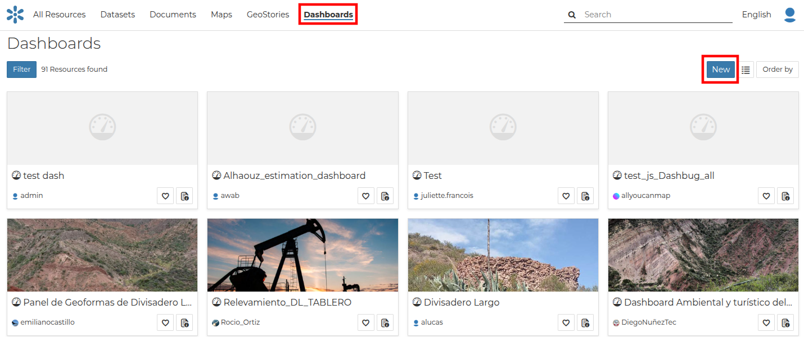

.. _dashboard:

Dashboard
=========

Dashboard is a MapStore tool integrated in GeoNode that provides the user with a space to add many Widgets, such as charts, maps, tables, texts and counters, and can create connections between them in order to:

* Provide an overview to better visualize a specific data context
* Interact spatially and analytically with the data by creating connections between widgets
* Perform analysis on involved data/layers

To build a new Dashboard go to :guilabel:`Add Resource` option on the *All Resources* page and choose option *Create dashboard* or select :guilabel:`New` option on the *Dashboards* page

  .. figure:: img/create_dashboard_link.png
      :align: center

      *Create dashboard from All Resources page*

      *Create dashboard from Dashboards page*

Now you landed on the Dashboard edition page that you can start to create a dashboard:

.. figure:: img/dashboard_1.png
    :align: center

    *New Dashboard Apps option*

Further Reading
---------------

Follow the link below to get more detailed information about the usage of Dashboard.

`Dashboard Documentation <https://mapstore.readthedocs.io/en/latest/user-guide/exploring-dashboards>`_
