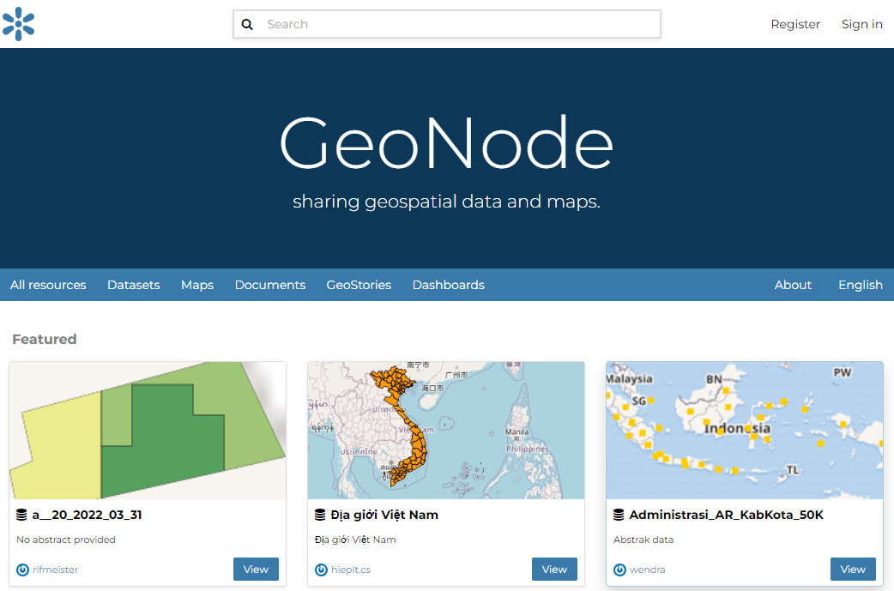

.. _data-types:

Data Types
==========

| GeoNode welcome page shows a variety of information about the current GeoNode instance.
| You can explore the existing data using many search tools and filters (see :ref:`finding-data`) or through the links of the navigation bar at the top of the page.
| There are five main types of resources that GeoNode can manage:

#. Datasets
#. Maps
#. Documents
#. GeoStories
#. Dashboards

Each resource type has its own menu and can be reached through :guilabel:`Datasets`, :guilabel:`Maps`, :guilabel:`Documents`, :guilabel:`GeoStories` and :guilabel:`Dashboards` buttons on the navigation bar

.. note:: :guilabel:`GeoStories` and :guilabel:`Dashboards` In the screenshot below are GeoApp resouce types which are added by the client.

     *Data menu*

.. _document-data-type:

Datasets
------

| Datasets are a primary component of GeoNode.
| Datasets are publishable resources representing a raster or vector spatial data source. Datasets also can be associated with metadata, ratings, and comments.

| By clicking the Datasets link you will get a list of all published datasets. If logged in as an administrator, you will also see the unpublished datasets in the same list.
| GeoNode allows the user to upload vector and raster data in their original projections using a web form.

Vector data can be uploaded in many different formats (ESRI Shapefile, KML and so on...). Satellite imagery and other kinds of raster data can be uploaded as GeoTIFFs.

Maps
----

| Maps are a primary component of GeoNode.
| Maps are comprised of various datasets and their styles. Datasets can be both local datasets in GeoNode as well as remote datasets either served from other WMS servers or by web service datasets such as Google or MapQuest.
GeoNode maps also contain other information such as map zoom and extent, dataset ordering, and style.

You can create a map based on uploaded datasets, combine them with some existing datasets and a remote web service dataset, share the resulting map for public viewing.
Once the data has been uploaded, GeoNode lets the user search for it geographically or via keywords and create maps.
All the datasets are automatically reprojected to web mercator for maps display, making it possible to use popular base maps such as `OpenStreetMap <https://www.openstreetmap.org>`_.

Documents
---------

| GeoNode allows to publish tabular and text data and to manage metadata and associated documents.
| Documents can be uploaded directly from your disk (see :ref:`uploading-documents` for further information).
| The following documents types are allowed: `txt, .log, .doc, .docx, .ods, .odt, .sld, .qml, .xls, .xlsx, .xml, .bm, .bmp, .dwg, .dxf, .fif, .gif, .jpg, .jpe, .jpeg, .png, .tif, .tiff, .pbm, .odp, .ppt, .pptx, .pdf, .tar, .tgz, .rar, .gz, .7z, .zip, .aif, .aifc, .aiff, .au, .mp3, .mpga, .wav, .afl, .avi, .avs, .fli, .mp2, .mp4, .mpg, .ogg, .webm, .3gp, .flv, .vdo, .glb, .pcd, .gltf`.
| Through the document detailed page is possible to view, download and manage a document.

GeoStories
---------

| GeoStory is a MapStore tool integrated in GeoNode that provides the user a way to create inspiring and immersive stories by combining text, interactive maps, and other multimedia content like images and video or other third party contents. Through this tool you can simply tell your stories on the web and then publish and share them with different groups of GeoNode users or make them public to everyone around the world.

Dashboard
---------

| Dashboard is a MapStore tool integrated in GeoNode that provides the user with a space to add many Widgets, such as charts, maps, tables, texts and counters, and can create connections between them in order to:
| - Provide an overview to better visualize a specific data context
| - Interact spatially and analytically with the data by creating connections between widgets
| - Perform analysis on involved data/layers
