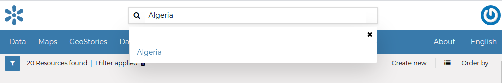
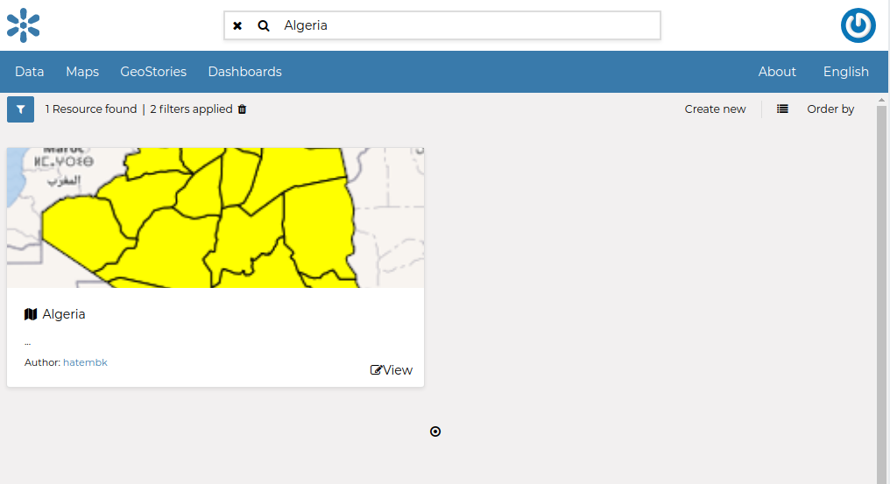
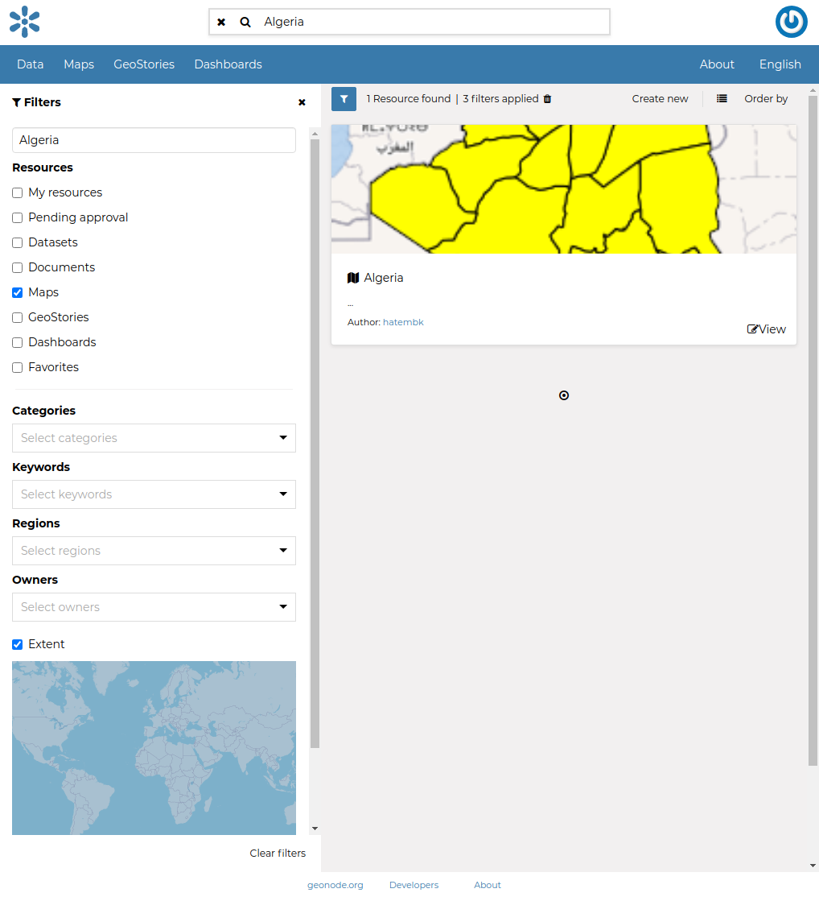
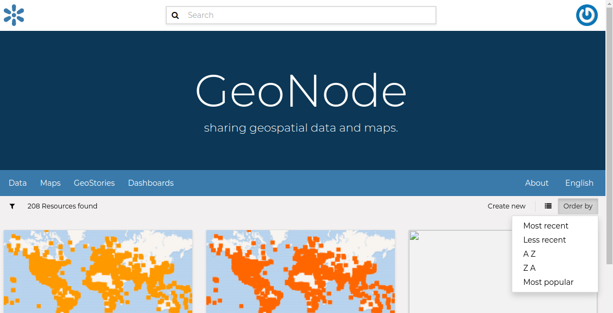
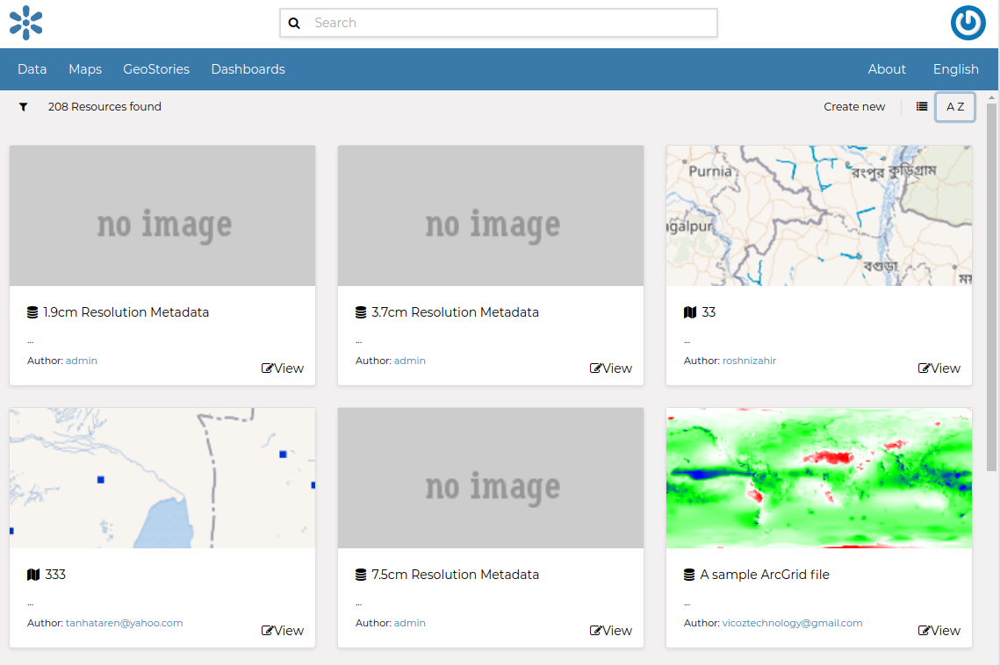

.. _finding-data:

Finding Data
============

| This section will guide you to navigate GeoNode to find datasets, maps and documents and other resource types by using different routes, filters and search functions.
| On every page you can find some quick search tool.

The *Search* box in the navigation bar (see the picture below) let you type a text and find all the data which have to deal with that text.

     *Search tool in GeoNode welcome page*

When you trigger a search you are brought to the *Search* page which shows you the search result through all data types.

     *The Search page*

| This page contains a wealth of options for customizing a search for various information on GeoNode. This search form allows for much more fine-tuned searches than the simple search box is available at the top of every page.
| It is possible to search and filter data by Text, Types, Categories, Keywords, Owners, Regions or Extent.

Try to set some filter and see how the resulting data list changes accordingly. An interesting type of filter is *EXTENT*: you can apply a spatial filter by moving or zooming a map within a box as shown in the picture below.

     *Search filter by EXTENT*

Data can be ordered by Most recent, Less recent, Name and Popularity.

     *Ordering Link*

     *Ordering Data*

For *Users* see :ref:`user-info`.
