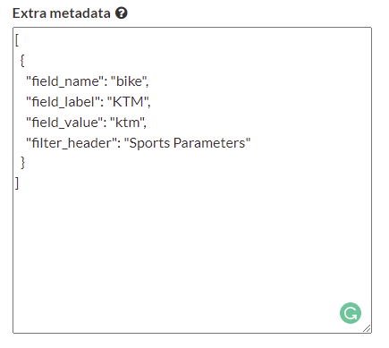
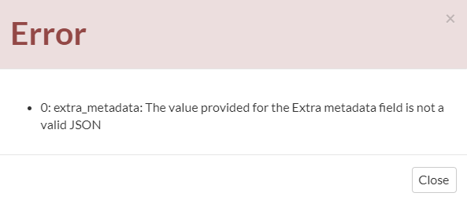
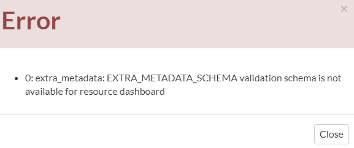
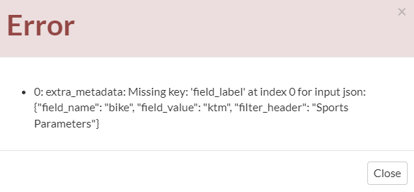

.. _data:

Metadata manipulation
=====================

There are two possible ways to manipulate extra metadata in geonode:

- via Metadata Editor (Wizard and advanced)
- via Rest API

Metadata Editor (wizard/advanced):
----------------------------------

The metadata section is placed under the OPTIONAL METADATA section available for all the GeoNode resources.

The metadata must follow two specific rules to save to the resource:

- Must always be a list of JSON. This permits to add of more than one metadata for each resource
- The JSON must follow the schema defined in the `settings.py` for the selected resource.

For example, for my document resource, I can have something like the following:

     *Advanced edit wizard menù*

After pressing the save button, the system will perform the following checks:

- Check if the text provided is a valid JSON. In case of wrong format input, the following error is shown:

     *invalid JSON error*

- Check if the metadata schema is provided for the resource if not will raise the following error

     *missing schema error*

- Check if the metadata schema is coherent with the schema defined in the settings. In case of wrong format input, the error will print the missing JSON keys

     *invalid schema error*

Rest API
--------

The `api/v2/resources` endpoint provide different ways to handle the metadata.

**GET:**

Get the metadata list of the selected resource

.. code-block:: python

     URL: http://host/api/v2/resources/{resource_id}/extra_metadata

     Response:

     [
          {
               "id": 1,
               "field_name": "bike",
               "field_label": "KTM",
               "field_value": "ktm",
               "filter_header": "Sports Parameters"
          }
     ]

**POST:**

Adding new metadata to the resource

.. code-block:: python

     URL: http://host/api/v2/resources/{resource_id}/extra_metadata    
     data = [
          {
               "field_name": "bike",
               "field_label": "KTM",
               "field_value": "ktm",
               "filter_header": "Sports Parameters"
          }
     ]
 
     Response:
     status_code: 201
     response json: List of the available metadata for the resource
     [
          {
               "id": 1,
               "field_name": "bike",
               "field_label": "KTM",
               "field_value": "ktm",
               "filter_header": "Sports Parameters"
          }
     ]

**PUT:**

Update specific metadata for the selected resource. In this case the metadata **ID** is required to perform the update

.. code-block:: python

     http://host/api/v2/resources/{resource_id}/extra_metadata
     payload:
     [
          {
               "id": 1,
               "field_name": "bike",
               "field_label": "KTM - sport", <- this value need to be updated
               "field_value": "ktm",
               "filter_header": "Sports Parameters"
          }
     ]
 
     Response:
     status_code: 200
     response: the available payload for the selected resource
     [
          {
               "id": 1,
               "field_name": "bike",
               "field_label": "KTM - sport",
               "field_value": "ktm",
               "filter_header": "Sports Parameters"
          }
     ]

**DELETE:**

Delete the metadata for a given resource by *ID*.

.. code-block:: python

     http://host/api/v2/resources/{resource_id}/extra_metadata
     payload: list of ID to be deleted
     [
          1, 2, 3, 4, 5
     ]

     Response:
     status_code: 200
     response: List of the available metadata
     
     []

**API search**

Is possible to search for resources with specific metadata. This feature is available for both API v1 and API v2

APIv1:

To perform the search is enough to add as query parameters the field of the metadata payload.

Assuming that the payload is the same as the example above, the URL could be something like the following:

`http://host/api/base/?metadata__field_category=bike`

In this way, we can retrieve all the resources that have at least 1 metadata with the `field_category = 'bike'`

APIv2

For the API v2 is a bit different since the library doesnt have a support for the JSON field. 

To reproduce the same search above, we need to call a URL like the following one:

`http://localhost:8000/api/v2/resources?filter{metadata.metadata.icontains}=%22field_category%22:%20%22bike%22`

In this way, we can retrieve all the resources that have at least 1 metadata with the `field_category = 'bike'`

Facet Filtering
---------------

