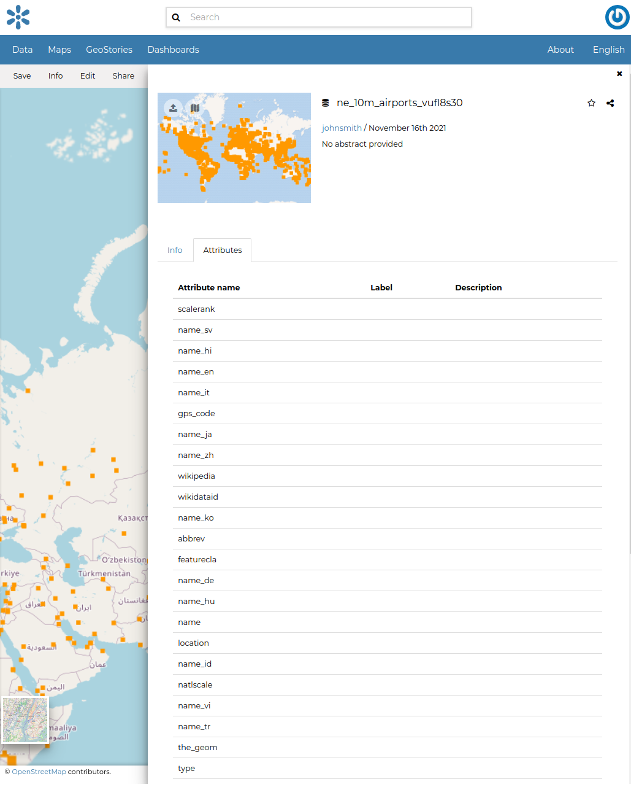

.. _dataset-info:

Dataset Information
=================

| In this section you will learn more about datasets. In the :ref:`finding-data` section we explain how to find datasets, now we want to go more in depth showing you how to explore detailed information about that.
| From the resource list page, filter with datasets, click on the dataset you are interested in. The overview page will be shown on the right, Then click on *View dataset*, The dataset detail page will open.

| The Dataset page has a menu which helps us to view and update dataset attributes.

    *Dataset Menu*

Dataset Info
-------------
When you click the *Info* link in the menu, a new page will be opened on right.

* The *Info* tab is active by default. This tab section shows some dataset metadata such as its title, the abstract, date of publication etc. The metadata also indicates the dataset owner, what are the topic categories the dataset belongs to and which regions are affected.

.. figure:: img/dataset_info.png
    :align: center

    *Dataset Infor tab*

* The *Attributes* tab shows the data structure behind the dataset. All the attributes are listed and for each of them some statistics (e.g. the range of values) are estimated (if possible).

    *Dataset Attributes tab*

* If you want this dataset in your *Favorites* (see :ref:`editing-profile`), You can click on star icon near the datset name.
