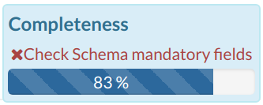
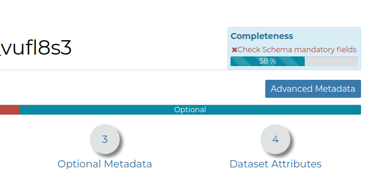

.. _dataset-metadata:

Datasets Metadata
===============

In GeoNode special importance is given to *Metadata* and their standard formats.

Editing Metadata
---------------

| Metadata contains all the information related to the dataset. They provide essential information for its identification and its comprehension. Metadata also make the dataset more easily retrievable through search by other users.
| The *Metadata* of a dataset can be changed through a *Edit Metadata* form which involves four steps, one for each type of metadata considered:

You can open the *Metadata* form of a *Dataset* by clicking the :guilabel:`Edit Metadata` link from the :guilabel:`Edit` options on the *Dataset Page*.

* **Basic Metadata**

  The first two steps are mandatory (no datasets will be published if the required information are not provided) whereas the last two are optional.

  .. figure:: img/basic_dataset_metadata.png
      :align: center

      *Basic Dataset Metadata*

  In the first step the system asks you to insert the following metadata:

  * *Thumbnail* of the dataset (click :guilabel:`Edit` to change it);
  * *Title* of the dataset, which should be clear and understandable;
  * *Abstract*; brief narrative summary of the content of the dataset

        .. note:: The *Abstract* panel allows you to insert HTML code through a *wysiwyg* text editor

  * *Creation/Publication/Revision Dates*  which define the time period that is covered by the dataset;
  * *Keywords*, which should be chosen within the available list. The contributor search for available keywords by clicking on the searching bar, or on the folder logo representing, or by entering the first letters of the desired word;
  * *Category* which the dataset belongs to;
  * *Group* which the dataset is linked to.

* **Location and Licenses**

  .. figure:: img/location_licenses_dataset_metadata.png
      :align: center

      *Location and Licenses Metadata for Datasets*

  The following list shows what kinds of metadata you are required to enter (see also the picture below):

  * *Language* of the dataset;
  * *License* of the dataset;
  * *DOI* of the dataset; if available, this represents the `Digital Object Identifier <https://www.doi.org/>`_ of the resource
  * *Attribution* of the dataset; authority or function assigned, as to a ruler, legislative assembly, delegate, or the like
  * *Regions*, which informs on the spatial extent covered by the dataset. Proposed extents cover the following scales: global, continental, regional, national;
  * *Data Quality statement* (general explanation of the data producer's knowledge about the lineage of a dataset);
  * Potential *Restrictions* on dataset sharing.

        .. note:: The *Data Quality statement* and *Restrictions* panels allow you to insert HTML code through a *wysiwyg* text editor

* **Optional Metadata**

  .. figure:: img/optional_dataset_metadata.png
      :align: center

      *Optional Dtaset Metadata*

  Complementary information are:

  * *Edition* to indicate the reference or the source of the dataset;
  * *Purpose* of the dataset and its objectives;
  * *Supplemental information* that can provide a better understanding of the uploaded dataset;
  * *Maintenance frequency* of the dataset;
  * users who are *Responsible* for the dataset, its *Owner*, and the *Author* of its metadata;
  * *Spatial representation type* used.
  * *Related resources* to link one or multiple resources to the document. These will be visible inside the :ref:`dataset-info` panel

        .. note:: The *Purpose* and *Supplemental information* panels allow you to insert HTML code through a *wysiwyg* text editor

* **Dataset Attributes**

  .. figure:: img/dataset_attributes_dataset_metadata.png
      :align: center

      *Dataset Attributes Metadata for Dataset*

  At this step you can enrich the dataset attributes with useful information like the following:

  * The *Label* displayed
  * A detailed *Description*
  * The *Display Order*
  * The *Display Type*; the default value is *Label*, which means that the value of the attribute will be rendered as a plain text.
    There's the possibility to instruct GeoNode to threat the values as different media-types. As an instance, if the values of the
    selected attribute will contain image urls, by selecting the ``IMAGE`` *Display Type* you will allow GeoNode to render the image
    directly when querying the dataset from the maps. The same for ``VIDEO``, ``AUDIO`` or ``IFRAME`` mime types.
  * The *Visibile* flag; allows you to instruct GeoNode wether or not hiding an attribute from the *Get Feature Type* outcomes

  It is possible to define a completely custom ``HTML`` template for the *Get Feature Type* outcome. That is possible by enabling the *Use a custom template* flag as shown in the figure below.

  .. figure:: img/dataset_attributes_dataset_metadata_custom_ft.png
      :align: center

      *Use a custom template*

  By using the keywork ``${properties.<attribute_name>``, you can tell to GeoNode to render the actual value of the attribute on the map.

  As an instance, the example below

  .. figure:: img/dataset_attributes_dataset_metadata_custom_ft_html.png
      :align: center

      *Use a custom template: HTML*

  Will render an ``HTML Table`` along with values as shown here below

  .. figure:: img/dataset_attributes_dataset_metadata_custom_ft_outcome.png
      :align: center

      *Use a custom template: Get Feature Info outcome*

Use :guilabel:`next >>` or :guilabel:`<< back` to navigate through those steps. Once you have finished click on :guilabel:`Update`.

Some metadata are mandatory, if you miss any of that metadata the *Completeness* bar shows you a red message like the one in the picture below.

    *Completeness Progress Bar*

Metadata Advanced Editing
-------------------------

In the *Edit Metadata* page the :guilabel:`Advanced Metadata`  button is also available.

    *The Advanced Metadata button*

Click on it to display the *Metadata Advanced Editing Page*. That page allows you to edit all the dataset metadata described in the previous paragraph. Once you have finished to edit them click on :guilabel:`Update` to save your changes.
