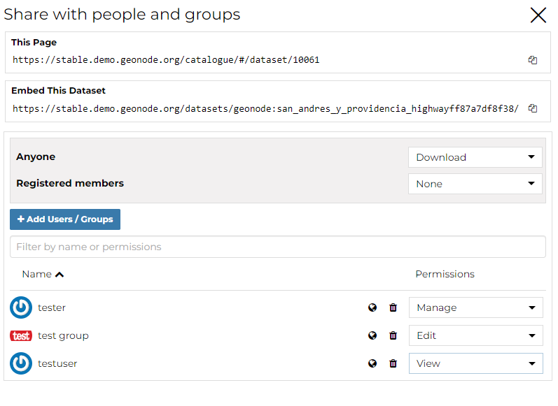

.. _dataset-permissions:

Share Options
=============

In order to modify the Dataset *Share options* settings, on the detail page of the dataset click the :guilabel:`Share` link in the menu. By default only owners can edit and manage datasets, anyone can view them.

.. figure:: img/change_dataset_permissions.png
    :align: center

    *Change Dataset Share options*

Through the *Share options Settings Panel* you can add or remove options for users and groups. The picture below shows an example.

    *Dataset Share options settings for users and groups*

You can set the following share options:

* *View* (allows to view the dataset).
* *Download* (allows to view and download the dataset).
* *Edit* (allows to change the dataset metadata,change attributes and properties of the datasets features and change the dataset style).
* *Manage* (allows to update, delete, change share options, publish and unpublish the dataset).

.. warning:: When assigning options to a group, all the group members will have those options. Be careful in case of editing them.

Click on :guilabel:`Save` link in the menu to save these settings.
