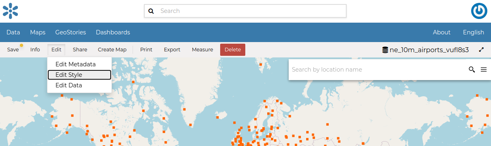
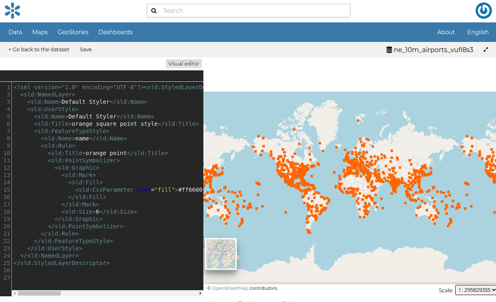
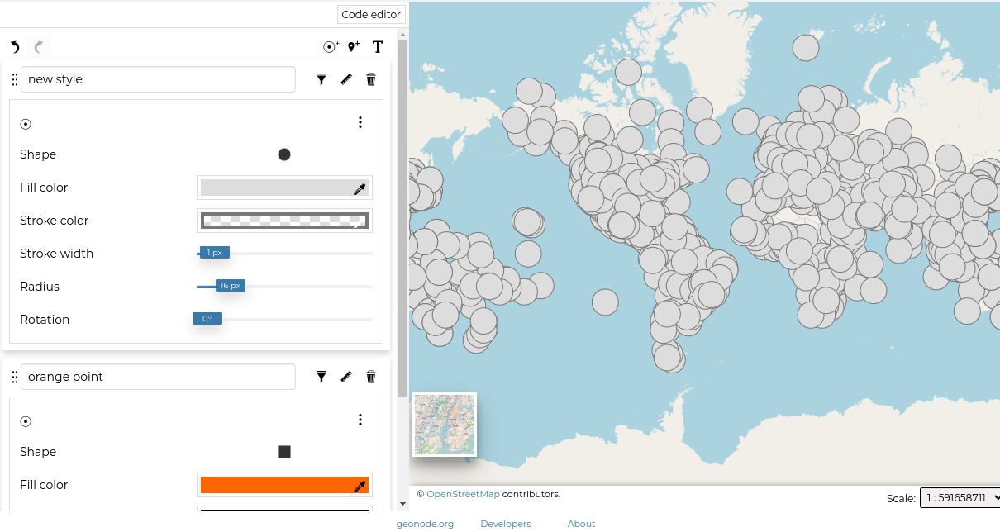

.. _dataset-style:

Dataset Styling
=============

Maps are helpful because they allow you gain a deeper understanding of your data by allowing you to visualize it in many different ways.
So you can tell different stories depending on how the data is presented.
For any given data or dataset, you should explore different styling options and choose the best style for that.

In GeoNode each dataset has one style refered to as a *Default Style* which is determined by the nature of the data you're mapping. When uploading a new dataset (see :ref:`uploading-datasets`) a new default style will be associated to it.

Editing the Dataset Style
-----------------------

In order to edit a dataset style, open the *Dataset Page* (see :ref:`dataset-info`) and click on :guilabel:`Edit`. Then click the :guilabel:`Edit Style` link in the *options* (see the picture below).

     *Edit Styles button*

The *Dataset* will open in a new *Map*. The *Styles Panel* will show you all the default style for the dataset and some useful tools. By default, a sample style will be shown in the map panel.

     *The Styles Panel in the Map*

The user is able to edit the default style, create new styles (as shown in the figure below) or delete a style by using the buttons in the upper part of the map panel:

.. figure:: img/create_new_style.png
     :align: center

     *Create a new style*

After creating a new style, you can apply it to the dataset.

.. figure:: img/new_style.png
     :align: center

     *New style applied*

Creating Style Rules
-------------------

In order to create a new rule, you should start editing the selected style. Three options are provided.

1. Mark rule
2. Icon rule
3. text rule

Click on any of the buttons below to create a type of style you want.

  .. figure:: img/add_style_buttons.png
       :align: center

       *Create new rule buttons*

The rule you have chosen is now added on the top with default attributes which you can edit to your preference*.

    *New style*

If the rule has errors, a popup message will inform the user that the style is invalid.

You can switch the rule ordering by dragging it to the top or bottom depending on your preference. It would be nice to change the style in order to decrease the opacity of the filling color as well as to reduce the lines width.
The embedded `MapStore <https://mapstore2.geo-solutions.it/mapstore/#/>`_ makes available a powerful *Style Editor* to accomplish that tasks. In the next paragraph we will explain how.

To apply the changes of each rule, click the :guilabel:`tick` button on the upper part of the style panel while to save the dataset's style click on :guilabel:`Save` on the top to save your changes.

.. figure:: img/save_style.png
    :align: center

    *Save the style*

You can further edit the style with the text editor by selecting the :guilabel:`General` and :guilabel:`Display` tabs.

.. figure:: img/styles_map_panel_display.png
     :align: center

     *Display tab on the Styles Panel*
