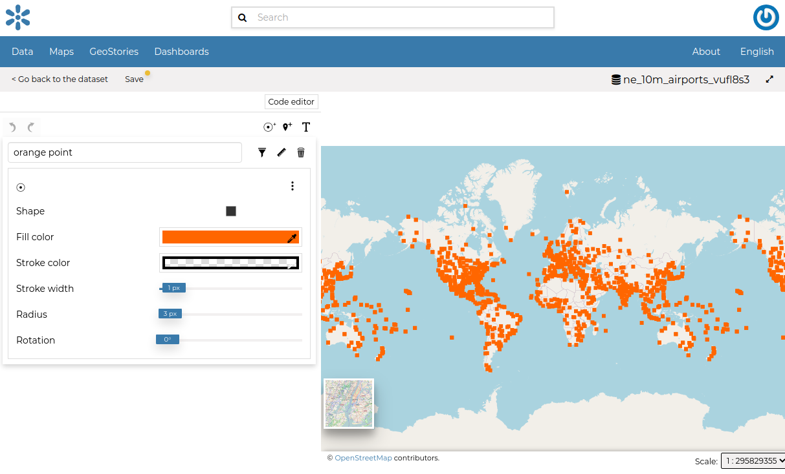
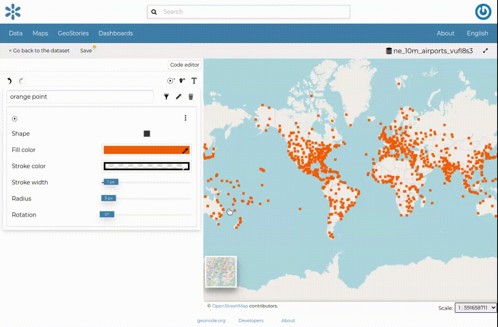

.. _dataset-style:

Dataset Styling
=============

Maps are helpful because they allow you gain a deeper understanding of your data by allowing you to visualize it in many different ways.
So you can tell different stories depending on how the data is presented.
For any given data or dataset, you should explore different styling options and choose the best style for that.

In GeoNode each dataset has a *Default Style* which is determined by the nature of the data you're mapping. When uploading a new dataset (see :ref:`uploading-datasets`) a new default style will be associated to it.

Editing the Dataset Style
-----------------------

In order to edit a dataset style, open the *Dataset Page* (see :ref:`dataset-info`) and click on :guilabel:`Edit`. Then click the :guilabel:`Edit Style` link in the *options* (see the picture below).

.. figure:: img/edit_style_button.png
     :align: center

     *Edit Styles button*

The *Dataset* will open in a new *Map*. The *Styles Panel* will show you all the available styles for the dataset and some useful tools. By default, the available default style will be showm in a text editor form.

.. figure:: img/styles_map_panel.png
     :align: center

     *The Styles Panel in the Map*

You could continue to change the style with the text editor or switch to a visualized editor using the :guilabel:`Visual editor` above the text editor.

The visual editor looks like this

     *Visual Styles Panel in the Map*

You can then edit the style by clicking on each attribute of the style. see an example below.

.. figure:: img/edit_style.gif
     :align: center

     *Style Editing*

Creating new Styles
-------------------

In order to create a new style, Three options are provided.

1. Mark rule
2. Icon rule
3. text rule

Click on any of the buttons below to create a type of style you want.

  .. figure:: img/add_style_buttons.png
       :align: center

       *Create new style buttons*

The style you have chosen is now added on the top with default attributes which you can edit to your preference*.

.. figure:: img/new_style.png
    :align: center

    *New style*

If the style form has errors, the following will be shown.

    *Setting Style Error*

Now you can switch the style you want to set by dragging it to the top. See an example below.

.. figure:: img/setting_style.gif
    :align: center

    *Setting Style*

It would be nice to change the style in order to decrease the opacity of the filling color as well as to reduce the lines width.
The embedded `MapStore <https://mapstore2.geo-solutions.it/mapstore/#/>`_ makes available a powerful *Style Editor* to accomplish that tasks. In the next paragraph we will explain how.

| You can also decide to make your new style the *Default Style* of that dataset. Click on |set_style_as_default_button| to do that.

Each style has a delete icon on the top right which you can use to remove the style.

Click on :guilabel:`Save` on the top to save your changes.
