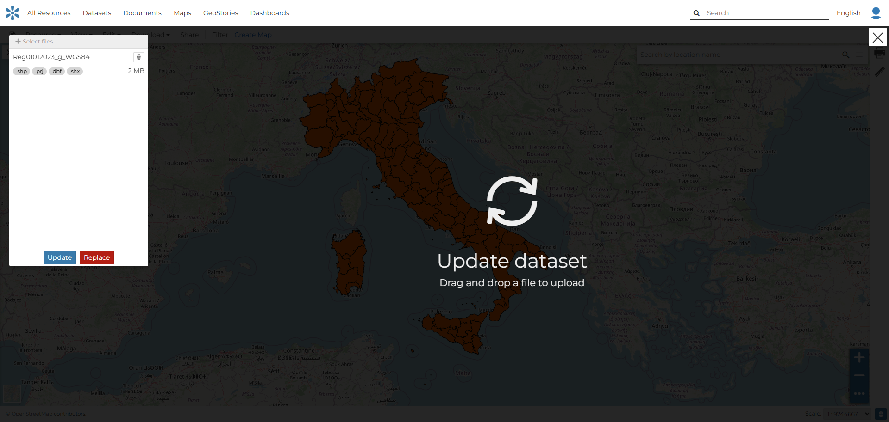

.. _dataset-update-replace:

Dataset Update and Replace
===============

Any type of dataset resource can be fully *replaced* with a new version. This operation fully replaces previous content, but maintain metadata and settings for the existing resource.

GeoNode doesn't implement a versioning system, but through the replace and update operations an history of versions can be maintained if these operations are preceded by a **Clone** (*Resource* -> *Save As*) operation.

For vector datasets a more advanced *Update* operation allows updating and inserting new content without a full replacement of pre-existing data.

In this section you will learn how to update a *Dataset*. 

.. _dataset-replace:

Dataset Replacement (Vector and Raster)
------------------------

The :guilabel:`Update dataset` link of the *Edit* menu opens a dialog similar to the one for uploading new datasets. The sidebar, where the new dataset can be selected, shows to buttons at the bottom: :guilabel:`Replace` and :guilabel:`Update`.

     *Updating the Dataset Data*

The **Replace** operation fully removes the existing data and overwrites it with a newly provided dataset. All **resource metadata** (such as title, abstract, keywords, permissions, and links) are preserved, while the underlying data content is entirely replaced.

The process is functionally equivalent to uploading a new dataset, with the key difference that the existing dataset is overwritten rather than creating a new resource.

.. warning:: **Important**: This operation is **not recoverable**. Once completed, it is not possible to restore the previous dataset content.

Behavior and Limitations:

* The dataset identifier and metadata remain unchanged.
* All existing features or raster data are permanently removed.
* The operation cannot be undone and should be used with caution.

.. _dataset-update:

Dataset Update (Vector)
------------------------

For vector datasets, GeoNode provides a more advanced update mechanism known as **Upsert**. This mode allows selectively updating existing features and inserting new ones based on a primary identifier.

The **Upsert** operation compares incoming vector data with the existing dataset and performs one of the following actions for each feature:

* **Update**: If a matching feature already exists, it is replaced with the new one.
* **Insert**: If no matching feature is found, the new feature is appended to the dataset.

The comparison is performed using a primary key field.
By default, the field used is **`fid`**, which is treated as the primary identifier of vector features.
If the incoming dataset contains the `fid` column, DigiNode performs a row-by-row comparison with the existing dataset:

  * When a matching `fid` is found, the existing feature is updated.
  * When no match is found, the feature is inserted as a new record.

Because the operation can result in both updates and insertions, it is referred to as an **Upsert**.

Validation and Constraints
^^^^^^^^^^^^^^^^^

The Upsert operation integrates with validation constraints defined at the GeoServer level.

From **GeoServer version 2.27.3**, it is possible to `define validation constraints on vector feature types <https://docs.geoserver.org/main/en/user/data/webadmin/layers.html#feature-type-details-vector>`_, including:

* Allowed value ranges for numeric fields
* Enumerated lists of accepted values for numeric or textual fields

If such constraints are defined on the feature type:

* DigiNode automatically applies them during the Upsert operation.
* Each incoming feature is validated against these constraints.
* If any feature violates the defined rules, the Upsert process is **stopped** and an error is returned.

Error Handling and Logging
^^^^^^^^^^^^^^^^^

When validation errors or processing issues occur:

* The Upsert operation is aborted.
* A **detailed error message** is returned to the user.
* A **log file** is generated at the end of the operation.

This log file is available in the **Assets panel** of the dataset and contains:

* A row-by-row report of processed features
* Details of successful updates or insertions
* Descriptions of validation failures or rejected records

.. warning:: The same conditions apply as for the replace operation

   - The Upsert operation is **not recoverable**.
   - Existing features may be permanently overwritten.
   - Careful validation of the input data is strongly recommended before execution