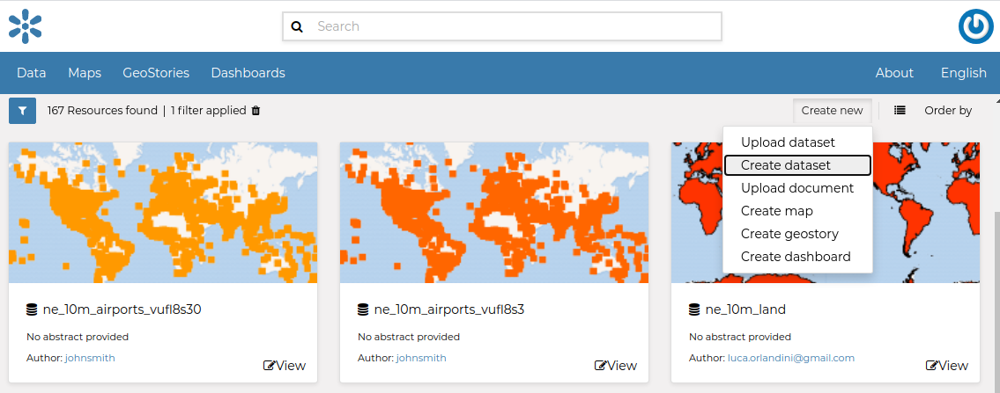
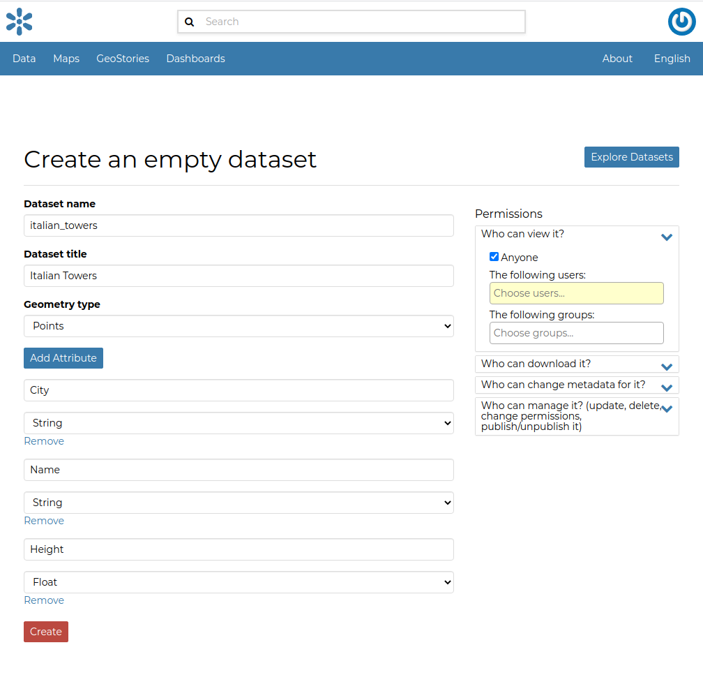

Creating a Dataset from scratch
=============================

An interesting tool that GeoNode makes available to you is the *Create dataset*. It allows you to create a new vector dataset from scratch. The *Dataset Creation Form* is reachable through the :guilabel:`Create dataset` link shown in the picture below.

     *Create dataset link*

In order to create the new Dataset you have to fill out the required fields:

* *Name*
* *Title*
* *Geometry type*

  .. figure:: img/geometry_types.png
      :align: center

      *Geometry types*

Usually the datasets features should have some *Attributes* that enrich the amount of information associated with each of them. Through the :guilabel:`Add Attribute` button you can add new attributes.

    *New Dataset creation from scratch*

Once the form has been filled out, click on :guilabel:`Create`. You will be redirected to the *Dataset Page* (see :ref:`dataset-info`). Now your Dataset is created but is still empty, no features have been added yet. See the :ref:`dataset-editing` section to learn how to add new features.
