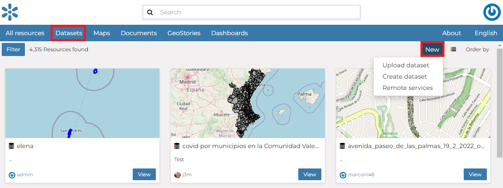

Creating a Dataset from scratch
=============================

An interesting tool that GeoNode makes available to you is the *Create dataset*. It allows you to create a new vector dataset from scratch. The *Dataset Creation Form* is reachable through the :guilabel:`Create dataset` link shown in the picture below.

     *Create dataset link*

The corresponding form where the users are able to create a dataset from scratch is presented below:

.. figure:: img/create_dataset_form.png
     :align: center

     *Form for creating a datset

In order to create the new Dataset you have to fill out the required fields:

* *Dataset title*
* *Geometry type*
* *Attributes* (name, geometry type, etc)

At first, the user has to define a dataset title and the geometry type:

  .. figure:: img/geometry_types.png
      :align: center

      *Geometry types*

While then, through the :guilabel:`Add Attribute` button, the user can add new attributes. Usually the datasets features should have some *Attributes* that enrich the amount of information associated with each of them.

.. figure:: img/new_dataset_from_scratch.png
    :align: center

    *New Dataset creation from scratch*

Defining attributes contraints
^^^^^^^^^^^^^^^^^

For Numeric and Textual attributes two contraints can be defined. These will contraint the admitted values for the attribute, either during a :ref:`dataset-update` operation or a :ref:`dataset-editing` session.

Two types of contraints can be selected from the dropdown under the *Restrictions* column:

* **Options**: For numeric and string values a list of controlled values (domain) can be defined.
.. figure:: img/create_dataset_contraints_options.png
     :align: center
* **Range**: For numeric values a range of values can be defined. This will contraint the admitted values for the attribute, either during a *Dataet Update* operation or a *Data Editing* session.
.. figure:: img/create_dataset_contraints_range.png
     :align: center

Once the form has been filled out, click on :guilabel:`Create new dataset`. You will be redirected to the *Dataset Page* (see :ref:`dataset-info`). Now your Dataset is created but is still empty, no features have been added yet. See the :ref:`dataset-editing` section to learn how to add new features.
