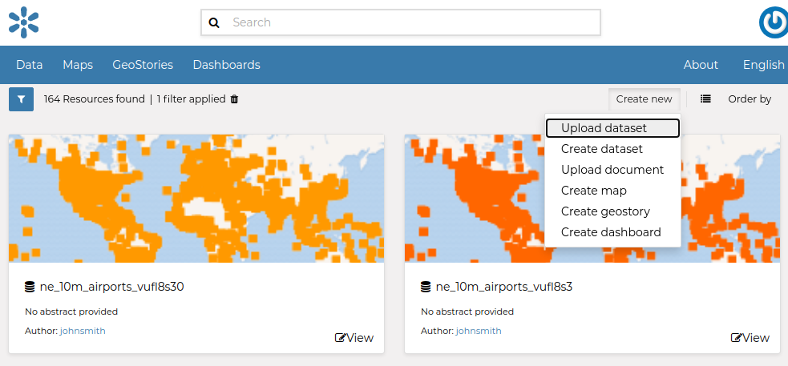
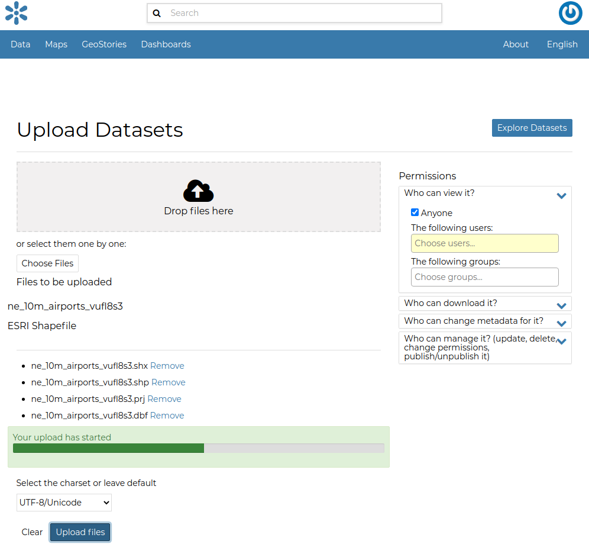
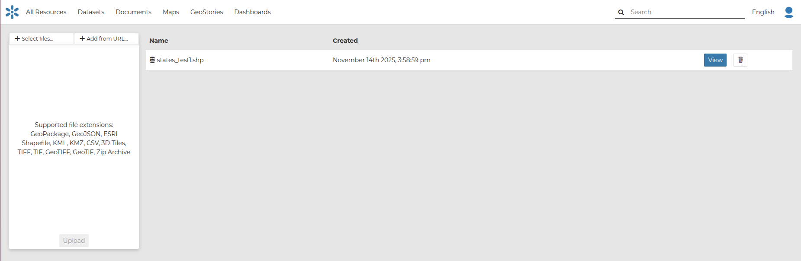

.. _uploading-datasets:

Datasets Uploading
================

| The most important resource type in GeoNode is the *Dataset*. A dataset represents spatial information so it can be displayed inside a map.
| To better understand what we are talking about lets upload your first dataset.

The *Dataset Uploading* page can be reached from the :guilabel:`Upload dataset` link of the :guilabel:`Add Resource` menu above the resources list page.

     *Link for Datasets Uploading*

The *Datasets Uploading* page looks like the one in the picture below.

     *The Datasets Uploading page*

| Through the :guilabel:`Select files` button you can select files from your disk, make sure they are valid raster or vector spatial data, then you can click to :guilabel:`Upload` button. 
A progress bar shows the operation made during the dataset upload and alerts you when the process is over.

.. figure:: img/dataset_upload_confirm.png
     :align: center

     *Upload dataset*

In this example the ``ne_10m_airports2`` ESRI Shapefile, with all its mandatory files (`.shp`, `.shx`, `.dbf` and `.prj`), has been chosen.
When the process ends click on :guilabel:`View` button

     *Dataset uploading finished*

.. note:: There are lot of free spatial dataset available in the Internet. In this example, an extract of the Berlin city center roads map from the `BBBike extracts OpenStreetMap <https://extract.bbbike.org>`_ dataset has been used.

In the next paragraphs you will learn how to create a dataset from scratch, how to set share options, how to explore the dataset properties and how to edit them.

.. note:: If you get the following error message:

     ``Total upload size exceeds 100.0 MB. Please try again with smaller files.``
     
     This means that there is an upload size limit of 100 MB. An user with administrative access can change the upload size limits at the `admin panel for size limits <../../admin/upload-size-limits/index.html#upload-size-limits>`__.

     Similarly, for the following error message:
     
     ``The number of active parallel uploads exceeds 5. Wait for the pending ones to finish.``

     You can modify the upload parallelism limits at the `admin panel for parallelism limits <../../admin/upload-parallelism-limit/index.html#upload-parallelism-limits>`__.
