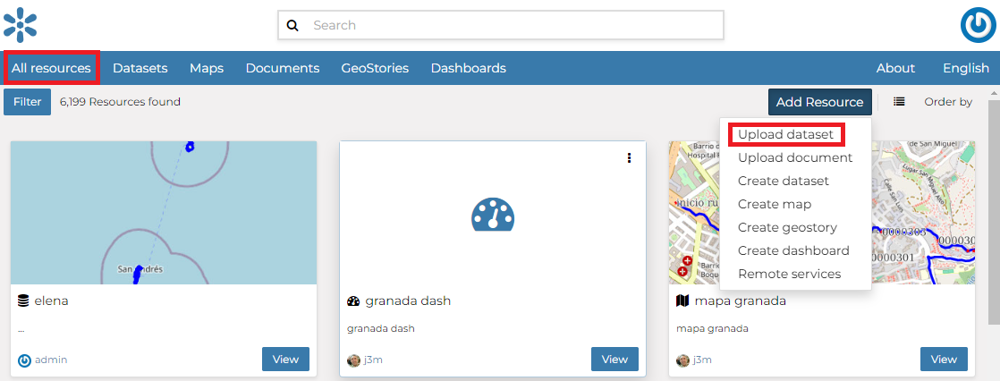

.. _uploading-datasets:

Datasets Uploading
================

| The most important resource type in GeoNode is the *Dataset*. A dataset represents spatial information so it can be displayed inside a map.
| To better understand what we are talking about lets upload your first dataset.

The *Dataset Uploading* page can be reached from the :guilabel:`Upload dataset` link of the :guilabel:`Create new` menu above the resources list page.

     *Link for Datasets Uploading*

The *Datasets Uploading* page looks like the one in the picture below.

     *The Datasets Uploading page*

| Through the :guilabel:`Choose Files` button you can select files from your disk, make sure they are valid raster or vector spatial data. You can also change the default *Share options* settings (see :ref:`dataset-permissions` for further information on how to set share options).
| Select the *charset*, then click on :guilabel:`Upload files` to start the process or click :guilabel:`Clear` to remove all the loaded files form the page.

In this example the ``ne_10m_airports_vufl8s3`` ESRI Shapefile, with all its mandatory files (`.shp`, `.shx`, `.dbf` and `.prj`), has been chosen.
A progress bar shows the operation made during the dataset upload and alerts you when the process is over.
When the process ends click the dsataset name in the table to check the dataset has been correctly uploaded.

.. figure:: img/dataset_upload_confirm.png
     :align: center

     *Dataset uploading finished*

.. note:: There are lot of free spatial dataset available in the Internet. In this example, an extract of the Berlin city center roads map from the `BBBike extracts OpenStreetMap <https://extract.bbbike.org>`_ dataset has been used.

In the next paragraphs you will learn how to create a dataset from scratch, how to set share options, how to explore the dataset properties and how to edit them.

.. note:: If you get the following error message:

     ``Total upload size exceeds 100.0 MB. Please try again with smaller files.``
     
     This means that there is an upload size limit of 100 MB. An user with administrative access can change the upload limits at the `admin panel <../../admin/upload-size-limits/index.html#upload-size-limits>`__.
