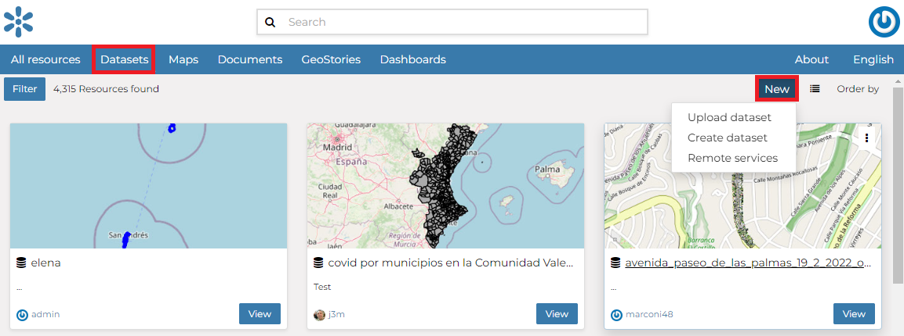
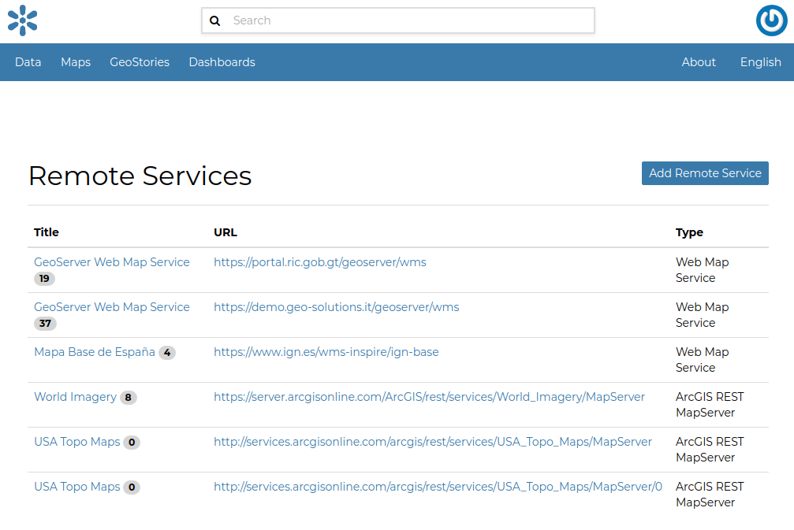
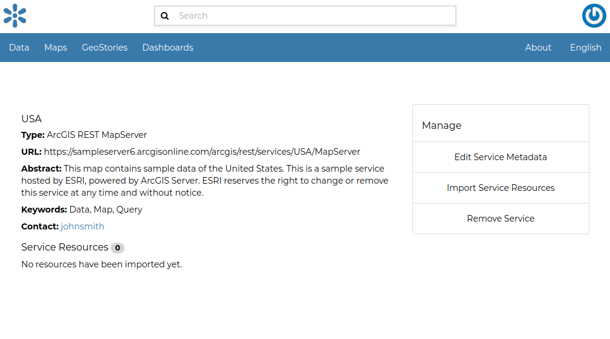

Using Remote Services
=====================

In GeoNode you can add new datasets not only by loading them from your disk but also using *Remote Services*.
In this section you will learn how to add a new service and how to load resources in GeoNode through that.

Let's try it!

Click on the :guilabel:`Remote Services` link of the :guilabel:`Add Resource` menu in the navigation bar.

    *Remote Services link*

The page that opens will contain the list of the available services.

    *Remote Services*

To configure a new service:

* click on :guilabel:`Add Remote Service`
* type the *Service URL*
* select the *Service Type*

  .. figure:: img/service_type.png
      :align: center

      *Service Types*

* click on :guilabel:`Create`

GeoNode supports four **types of remote services**:

* *Web Map Service*

  Generic Web Map Service (WMS) based on a standard protocol for serving georeferenced map images over the Internet.
  These images are typically produced by a map server (like `GeoServer <http://geoserver.org/>`_) from data provided by one or more distributed geospatial databases.
  Common operations performed by a WMS service are: *GetCapabilities* (to retrieves metadata about the service, including supported operations and parameters, and a list of the available datasets) and *GetMap* (to retrieves a map image for a specified area and content).

  .. note:: Lots of WMS services are available on the internet, in this example we used the ``https://demo.geo-solutions.it/geoserver/wms``.
  
* *GeoNode Web Map Service*

  Generally a WMS is not directly invoked; client applications such as GIS-Desktop or WEB-GIS are used that provide the user with interactive controls.
  A GeoNode WMS automatically performs some operations and lets you to immediately retrieve resources.

  .. note:: An example of GeoNode WMS is available at ``http://dev.geonode.geo-solutions.it/geoserver/wms``.

* *ArcGIS REST MapServer*

  This map service provides basic information about the map, including the datasets that it contains, whether the map is cached or not, its spatial reference, initial and full extents, whether the service is allowed to export tiles and max tiles export count, etc.
  A set of operations that manage the state and contents of the service are allowed: Edit Service, Refresh, Update Tiles.
  The URL should follow this pattern: ``https://<servicecatalog-url>/services/<serviceName>/MapServer``.

  .. note:: Try the following service to better understand how it works: ``https://sampleserver6.arcgisonline.com/arcgis/rest/services/USA/MapServer``.

* *ArcGIS REST ImageServer*

  This Image Server allows you to assemble, process, analyze, and manage large collections of overlapping, multiresolution imagery and raster data from different sensors, sources, and time periods. You can also publish dynamic image services that transform source imagery and other raster data into multiple image products on demand—without needing to preprocess the data or store intermediate results—saving time and computer resources. In addition, ArcGIS Image Server uses parallel processing across multiple machines and instances, and distributed storage to speed up large raster analysis tasks.
  The URL should follow this pattern: ``https://<servicecatalog-url>/services/<serviceName>/ImageServer``.

  .. note:: Try the following service to better understand how it works: ``https://sampleserver6.arcgisonline.com/arcgis/rest/services/Toronto/ImageServer``.

Once the service has been configured, you can load the resources you are interested in through the *Import Resources* page where you will be automatically redirected to.

| From the page where the services are listed, it is possible to click on the *Title* of a service. It opens the *Service Details* page.
| Each service has its own metadata such as the *Service Type*, the *URL*, an *Abstract*, some *Keywords* and the *Contact* user.

You can edit those metadata through the form available from the :guilabel:`Edit Service Metadata` link of the *Service Details* page (see the picture below).

    *Remote Service metadata*
