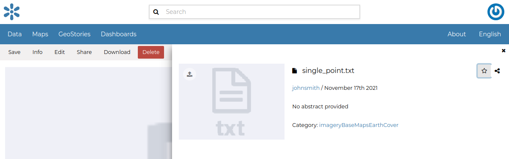

.. _document-info:

Document Information
====================

From the *Documents Search Page* (see :ref:`finding-data`) you can select the document you are interested in and click on its name to see an overview about it.

.. figure:: img/document_overview.png
    :align: center

You can access the document details page by clicking on *View document* in the overview panel.
That page looks like the one shown in the picture below.

.. figure:: img/document_detail.png
    :align: center

    *Document Information page*

On the page of a document, the resource is either directly displayed on the page or accessible by clicking on the link provided under the title.

Exploring the Document detail menu Sections
---------------------------

The **Info link** section shows the document metadata such as its title, abstract, date of publication etc. The metadata also indicates the user who is responsible for uploading and managing this content, as well as the group to which it is linked.

.. figure:: img/document_info.png
    :align: center

The **Share link** provides the document link to share.

.. figure:: img/document_sharing.png
    :align: center

    *Document Sharing*

If you want to download the document, click on the *Download* link in the menu and the document will be downloaded automatically.

.. figure:: img/document_download.png
    :align: center

    *Document Metadata download*

If you want this document in your *Favorites* (see :ref:`editing-profile`), click the **Info link** and click on the start icon.

    *Favorite document*
