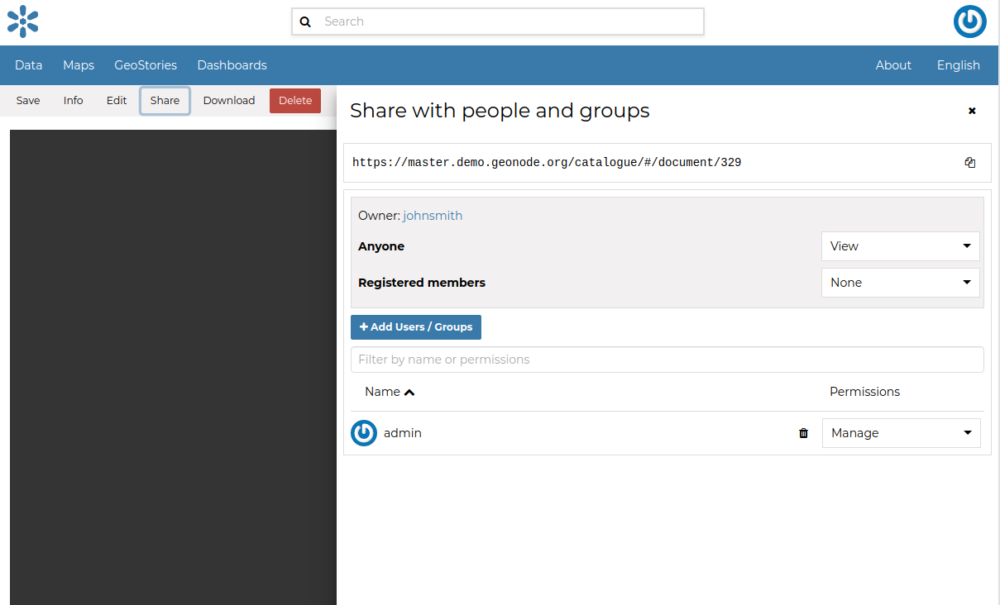
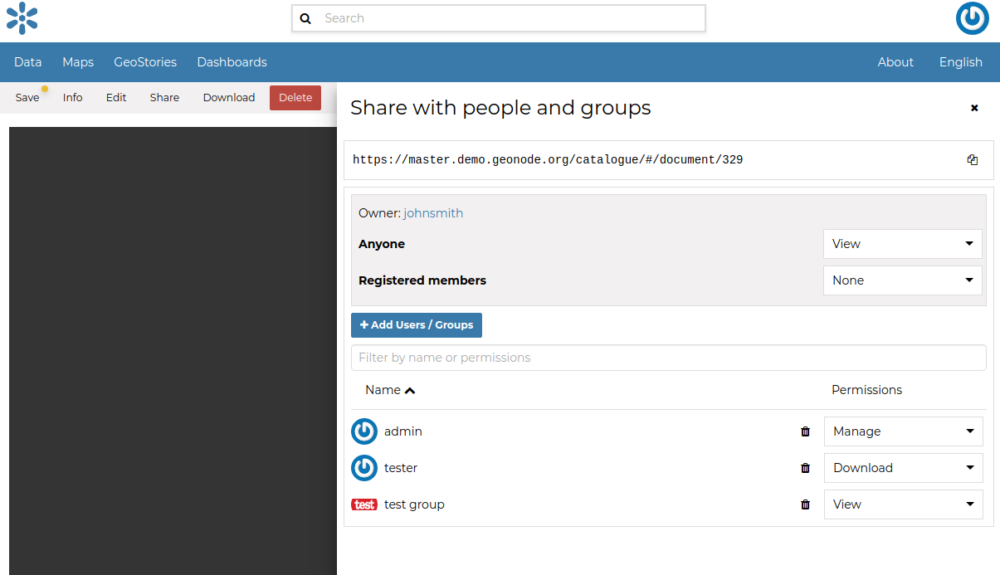

.. _edit-document-permissions:

Changing the Document Permissions
=================================

GeoNode encourages to publicly, share and make available for download information uploaded on the platform. By default, anyone can see and download a document. However, the document responsible can choose to limit access to the document to some contributors and/or groups.

Through the *Share* Link shown in the menu it is possible to manage the document permissions. it opens a form where set up who can:

* View the document;
* Download it;
* Edit its metadata;
* Manage it (update, delete, change permissions, publish/unpublish).

See an example in the picture below.

.. note::
    Aftr making changes, always save them with the *Save* Link in the menu

    *Changing the Document permissions*

Usually that editing of metadata and the management of a document are in charge of the responsible of the document, i.e. the contributor who uploaded it and who has those permissions by default.

Once the permissions are set, click :guilabel:`Apply changes` to save them.
