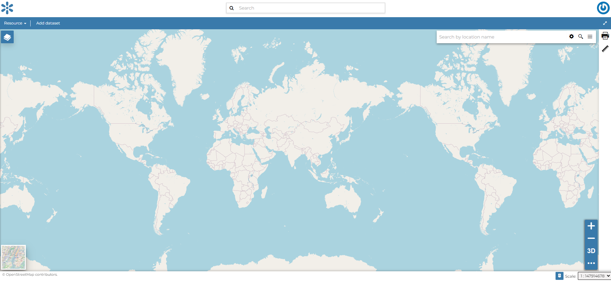

.. _creating-map:

Creating Maps
=============

In this section, we’ll create a *Map* using some uploaded datasets, combine them with some other datasets from remote web services, and then share the resulting map for public viewing.

In order to create new maps you can use:

* The :guilabel:`Create map` listed after clicking the :guilabel:`Create new` link on the menu above the resources list page.

  .. figure:: img/create_map_link.png
       :align: center

       *The Create Map link*

* The :guilabel:`Create map` link in the *Dataset Page* (it creates a map using a specific dataset)

  .. figure:: img/create_map_button.png
       :align: center

       *The Create map link from dataset*

The new *Map* will open in a *Map Viewer* like the one in the picture below.

     *The Map Viewer*

Using the :guilabel:`Add dataset` link, you can add a layer by clicking on one of the layers listed in the catalog.
In the upper left corner the *TOC button* button opens the :ref:`toc` of the *Map*. It allows to manage all the datasets associated with the map and to add new ones from the :guilabel:`Add dataset`.
The *TOC* component makes possible to manage datasets overlap on the map by shifting their relative positions in the list (drag and drop them up or down in the list).
It also allows to hide/show datasets ( |show_button| and |hide_button| ), to zoom to datasets extents ( |zoom_to_dataset_extent_button| ) and to manage their properties ( |dataset_settings_button| ).
Once the map datasets have been settled it is possible to save the *Map* by clicking on the :guilabel:`Save as` link in the map toolbar.

If you followed the steps above, you have just created your first *Map*.
Now you should see it in the *Explore Maps* page, see :ref:`map-info` for further details.

We will take a closer look at the *Map Viewer* tools in the :ref:`exploring-maps` section.

.. |show_button| image:: img/show_button.png
    :width: 30px
    :height: 30px
    :align: middle

.. |hide_button| image:: img/hide_button.png
    :width: 30px
    :height: 30px
    :align: middle

.. |zoom_to_dataset_extent_button| image:: img/zoom_to_dataset_extent_button.png
    :width: 30px
    :height: 30px
    :align: middle

.. |dataset_settings_button| image:: img/dataset_settings_button.png
    :width: 30px
    :height: 30px
    :align: middle