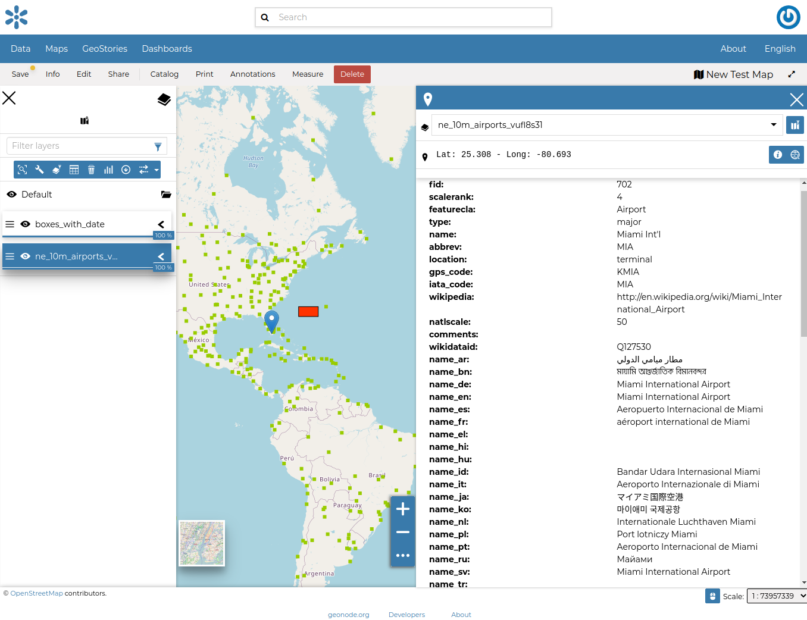
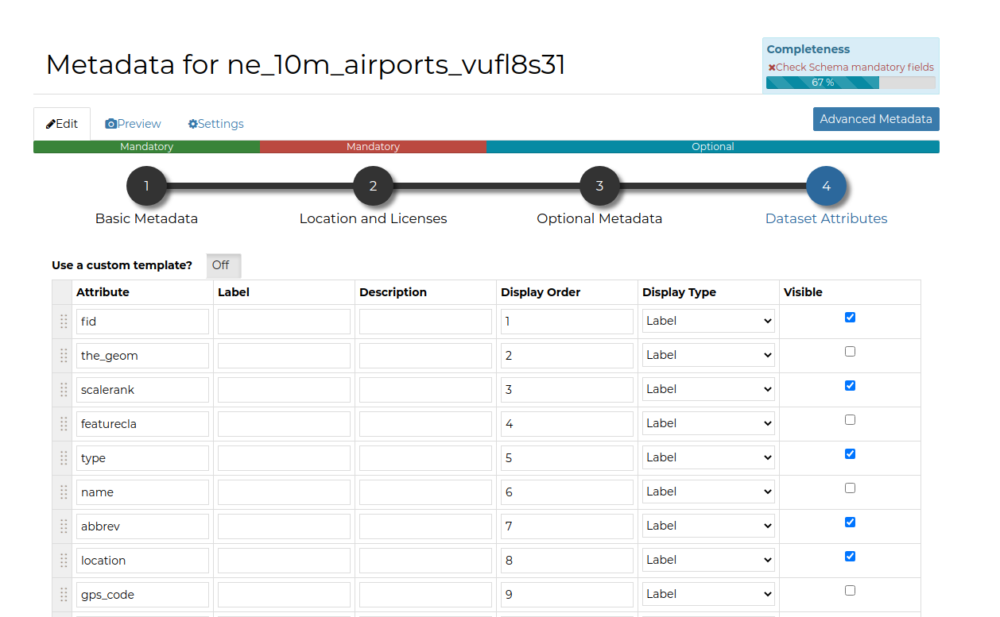
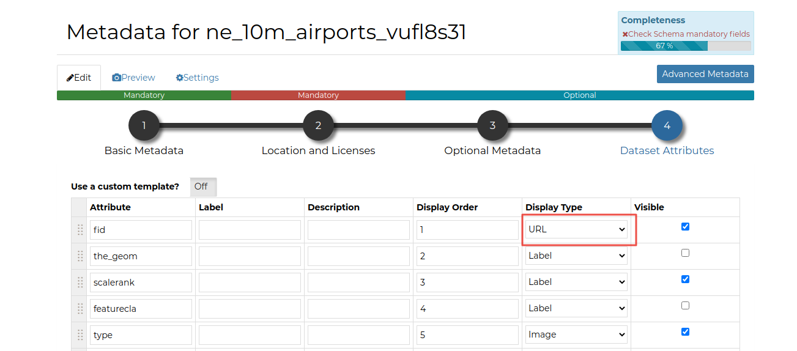
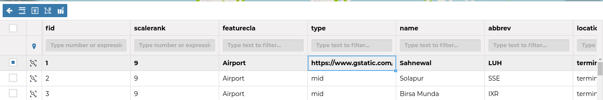
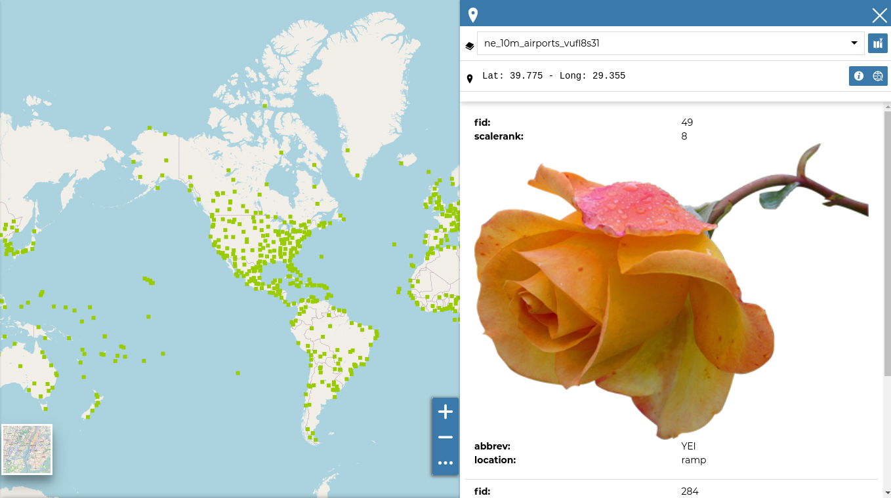
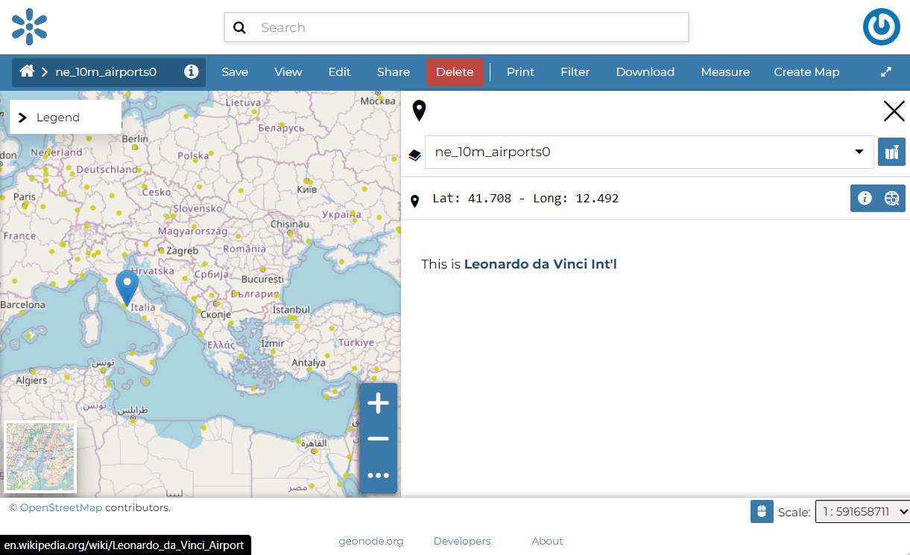

.. _getfetureinfo-templates:

Customizing The Layers' GetFeatureInfo Templates
================================================
When “clicking” over a feature of a Layer into a GeoNode Map, an info window popups showing a formatted representation of the raw data identified by the coordinates (see Fig. 1)

     *Fig. 1*

The way how such information is presented to the user is defined by what we call “GetFeatureInfo Template”. The latter is basically an HTML snippet containing some placeholders and special inline codes that instruct GeoServer on how to generate the raw data output.

The outcome is a rendered HTML snippet with the real values replacing the placeholders of the Template.

Currently, GeoNode allows a very simple mechanism to customize the “GetFeatureInfo Template” of a Layer.

It is possible, through the Layer Metadata Editor Wizard, to assign a name and a label to the attributes we want to display on the GetFeatureInfo output.

Notice that the attributes without a label and name, in case others are present, won’t be rendered at all.

As an instance, by using the example above, we can customize a bit the Layer Metadata as shown in Fig. 2

     *Fig. 2*

The “GetFeatureInfo” output will change accordingly as shown in Fig. 3

     *Fig. 3*

Simple Template: Assigning A Media-Type To Attribute Values
^^^^^^^^^^^^^^^^^^^^^^^^^^^^^^^^^^^^^^^^^^^^^^^^^^^^^^^^^^^
The easiest way to render a different media-type (:guilabel:`image`, :guilabel:`audio`, :guilabel:`video` or :guilabel:`iframe`) to a property value, is to change it from the :guilabel:`Metadata Editor Wizard` attributes panel.

By changing the :guilabel:`Display Type` of an attribute from this panel as shown in Fig. 4

     *Fig. 4*

GeoNode will create automatically the HTML media type when rendering by using the **value** of the selected property.

So, as an example, if, in the figure above, the attribute ``NAME`` contains values representing some ``links`` to other resources, GeoNode will create those links automatically for you when clicking over a geometry.

.. figure:: img/getfetureinfo_templates_005.png
     :align: center

     *Fig. 5*

Selecting :guilabel:`image` as media-type (Fig. 6)

.. figure:: img/getfetureinfo_templates_006.png
     :align: center

     *Fig. 6*

and editing the contents accordingly (Fig. 7)

.. warning: Pay attention to the **length** of the values you put into the properties. They must respect you data schema.

     *Fig. 7*

you will get a nice effect as shown in Fig. 8

     *Fig. 8*

Advanced Template: Use A Custom HTML Template
^^^^^^^^^^^^^^^^^^^^^^^^^^^^^^^^^^^^^^^^^^^^^

By selecting the option :guilabel:`Use a custom template?` as shown in Fig. 9

.. figure:: img/getfetureinfo_templates_009.png
     :align: center

     *Fig. 9*

You will be able to provide your own custom HTML Template for the Feature Info output.

The example below shows how it is possible to create a nice HTML output with an :guilabel:`image` taking the ``src`` from the attribute :guilabel:`NAME` values, through the use of the keyword ``${properties.NAME}``

.. figure:: img/getfetureinfo_templates_010.png
     :align: center

     *Fig. 10*

.. figure:: img/getfetureinfo_templates_011.png
     :align: center

     *Fig. 11*

     *Fig. 12*

.. figure:: img/getfetureinfo_templates_013.png
     :align: center

     *Fig. 13*

Optional: Customizing the HTML WYSIWYG Editor Menu Bar
^^^^^^^^^^^^^^^^^^^^^^^^^^^^^^^^^^^^^^^^^^^^^^^^^^^^^^
The :guilabel:`Menu Bar` and :guilabel:`Tool Bar` of the HTML Editor, can be easily customized by overriding the ``TINYMCE_DEFAULT_CONFIG`` variable on :guilabel:`settings.py` (see :ref:`tinyMCE Default Config Settings`)

There are many plugins and options allowing you to easily customize the editor and also provides some predefined *templates* to speed up the editing.

For more information about the Javascript tool, please refer to https://www.tiny.cloud/