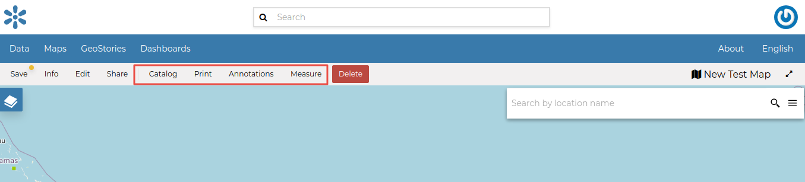
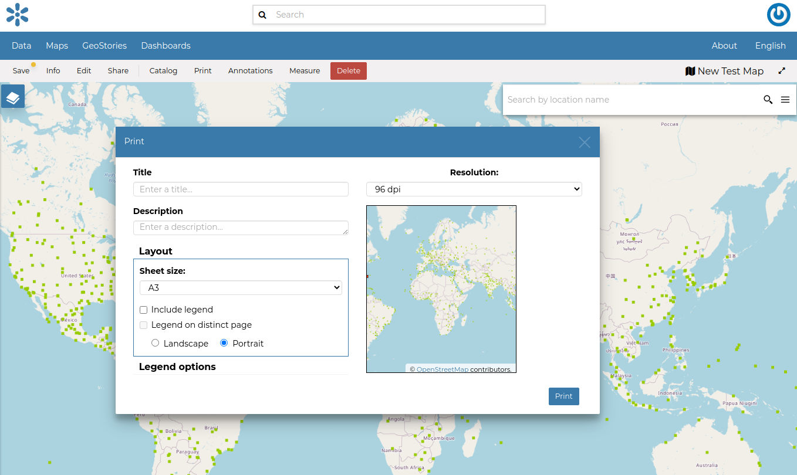
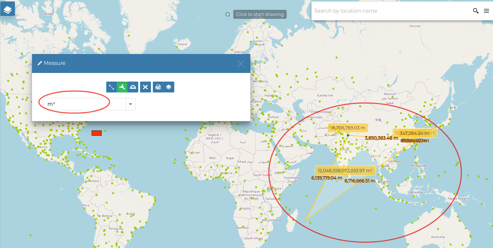
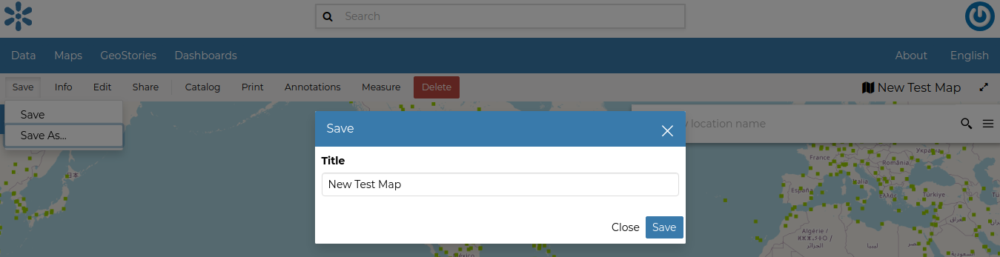

.. _options-menu-tools:

Other Menu Tools
==================

.. |burger_menu_button| image:: ../img/burger_menu_button.png
    :width: 30px
    :height: 30px
    :align: middle

At the top of the *Map* there are more menu items which we are are going to explain in this section.

     *The Map Options Menu*

Printing a Map
--------------

| The `MapStore <https://mapstore2.geo-solutions.it/mapstore/#/>`_ based map viewer of GeoNode allows you to print your map with a customizable layout.
| Click the :guilabel:`Print` option from the *Menu*, the **Printing Window** will open.

     *The Printing Window*

From this window you can:

* enter *Title* and *Description*;
* choose the *Resolution* in dpi;
* customize the *Layout*

  + the *Sheet size* (A3, A4);
  + if include the legend or not;
  + if to put the legend in a separate page;
  + the page *Orientation* (Landscape or Portrait);

* customize the *Legend*

  + the *Label Font*;
  + the *Font Size*;
  + the *Font Emphasis* (bold, italic);
  + if *Force Labels*;
  + if use *Anti Aliasing Font*;
  + the *Icon Size*;
  + the *Legend Resolution* in dpi.

To print the map click on :guilabel:`Print`.

The Datasets Catalog
------------------

All the datasets available in GeoNode, both uploaded and remote, can be loaded on the map through the *Catalog*.
Click on the :guilabel:`Catalog` option of the *Menu* to take a look at the catalog panel.

.. figure:: img/datasets_catalog.png
     :align: center

     *The Datasets Catalog*

You can navigate through datasets and look at their *Thumbnail* images, *Title*, *Description* and *Abstract*.
Click on :guilabel:`Add To Map` to load a dataset into the map, it will be also visible in the :ref:`toc`.

Performing Measurements
-----------------------

Click on the :guilabel:`Measure` option of the *Menu* to perform a measurement.
As you can see in the picture below, this tool allows you to measure *Distances*, *Areas* and the *Bearing* of lines.

.. figure:: img/measure_tool.png
     :align: center

     *The Measure Tool*

| To perform a measure draw on the map the geometry you are interested in, the result will be displayed on the left of the unit of measure select menu (this tool allows you to change the unit of measure also).

     *Measuring Areas*

Saving a map
------------

| Once all the customizations have been carried out, you can *Save* your map by clicking on the :guilabel:`Save` option of the *Menu*.
| Click :guilabel:`Save` again under the Save options.

|You could create a new map from the existing view by clicking :guilabel:`Save As..`.
| A new popup window will open.

     *Saving Maps*

The current map title is filled by default, You can change it to the prefered naming then click on :guilabel:`Save`. The page will reload and your map should be visible in the :ref:`finding-data` list.
