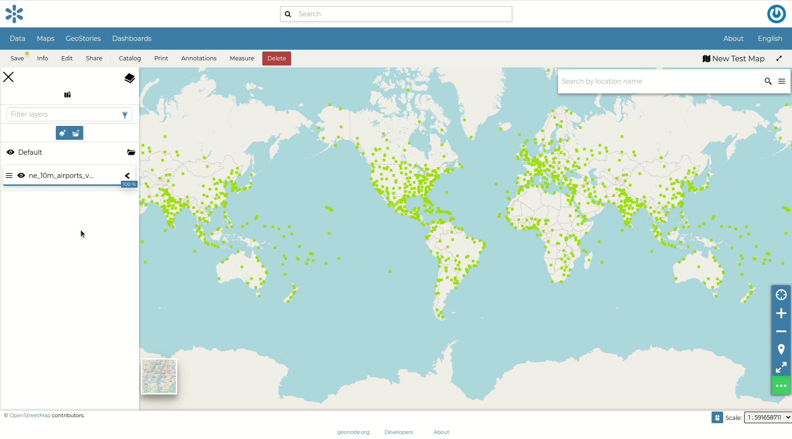
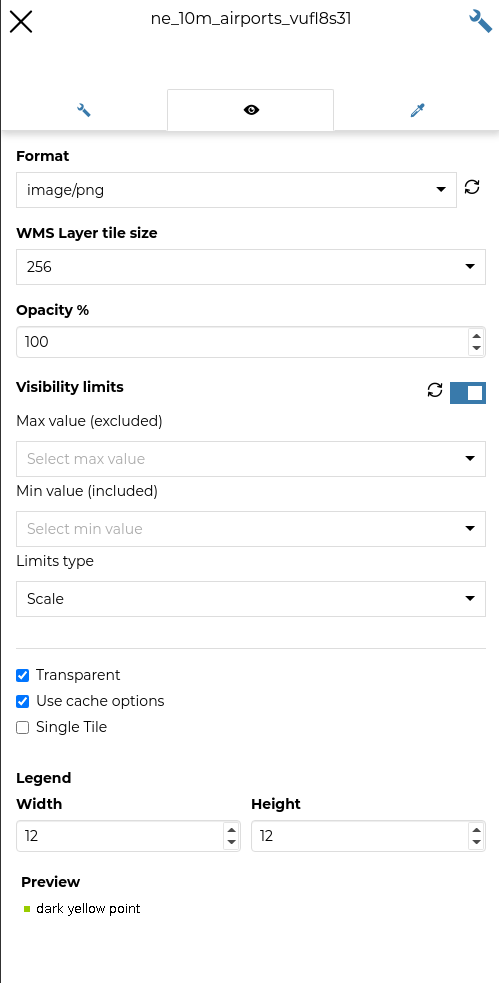

.. _toc:

Table of Contents (TOC)
=======================

In the upper left corner, click on |toc_button| to open the *Table Of Contents*, briefly *TOC* from now on, of the map.
The *TOC* shows all the datasets involved with the *Map* and allows to manage their properties and representations on the map.

.. figure:: img/toc_panel.png
     :align: center
     :height: 400px

     *The Table Of Contents (TOC)*

From the *TOC* you can:

* manage the datasets *Overlap*;
* filter the datasets list by typing text in the *Filter Datasets* field;
* add new datasets from the *Catalog* by clicking the :guilabel:`Add Dataset` button;
* manage the datasets properties such as *Opacity* (scroll the opacity cursor), *Visibility* (click on |hide_button| to make the dataset not visible, click on |show_button| to show it on map);
* manage the *Dataset Settings*, see the next paragraph.

     *Scrolling the Dataset Opacity*

Select a *Dataset* from the list and click on it, the *Dataset Toolbar* should appear in the *TOC*.

.. figure:: img/dataset_toolbar.png
     :align: center
     :height: 400px

     *The Dataset Toolbar*

The *Toolbar* shows you many buttons:

* |zoom_to_dataset_extent_button| allows you to zoom to the dataset extent;
* |dataset_settings_button| drives you through the dataset settings customization (see the next paragraph);
* |attribute_table_button| to explore the features of the dataset and their attributes (more information at :ref:`attributes-table`);
* |delete_dataset_button| to delete datasets (click on :guilabel:`Delete Dataset` to confirm your choice);

  .. figure:: img/delete_dataset.png
       :align: center

       *Deleting Datasets*

* |create_widgets_button| to create *Widgets* (see :ref:`creating-widgets`).

Managing Dataset Settings
-----------------------

The *Dataset Settings* panel looks like the one below.

.. figure:: img/dataset_settings_panel.png
     :align: center
     :height: 400px

     *The Dataset Settings Panel*

The *Dataset Settings* are divided in three groups:

1. *General* settings
2. *Display* settings
3. *Style* settings

In the **General** tab of the *Settings Panel* you can customize the dataset *Title*, insert a *Description* and change/create the *Dataset Group*.

Click on the **Display** tab to see what are the dataset appearance properties you can configure.

     *The Dataset Display Settings Panel*

| The *Format* field allows you to change the output format of the WMS requests.
| You can set a numeric value of *Opacity* using the corresponding input field.
| You can also set the dataset as *Transparent*, decide to *Use cache options* and to use *Single Tile*.

The third tab is the **Style** one. By clicking on it, an advanced *Style Editor* allows you to create new styles and to modify or delete an existing one. See the :ref:`dataset-style` section to read more.
