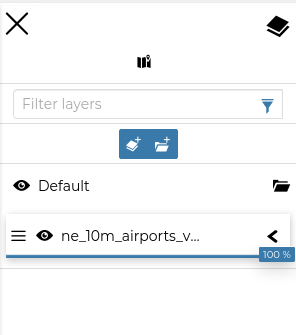
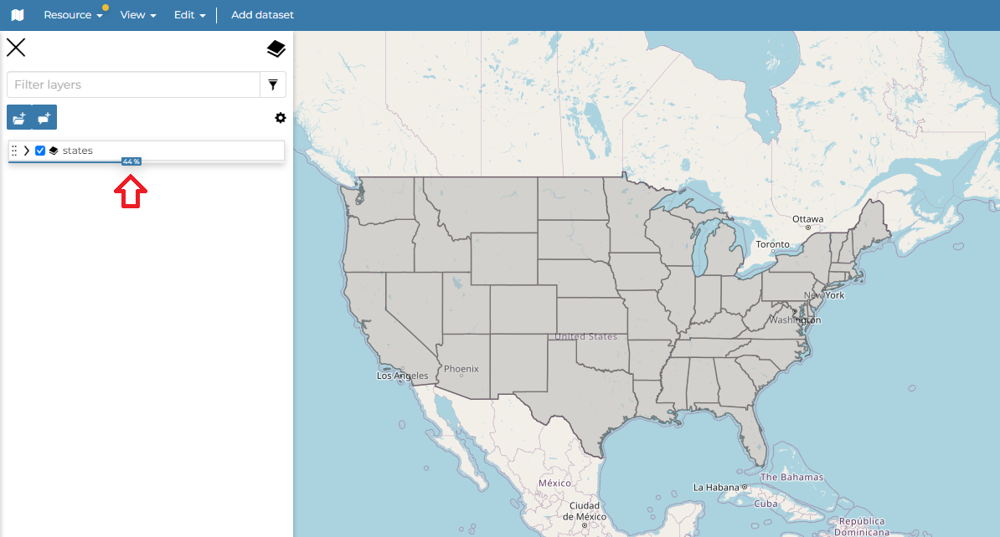
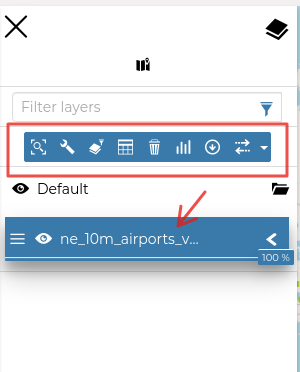
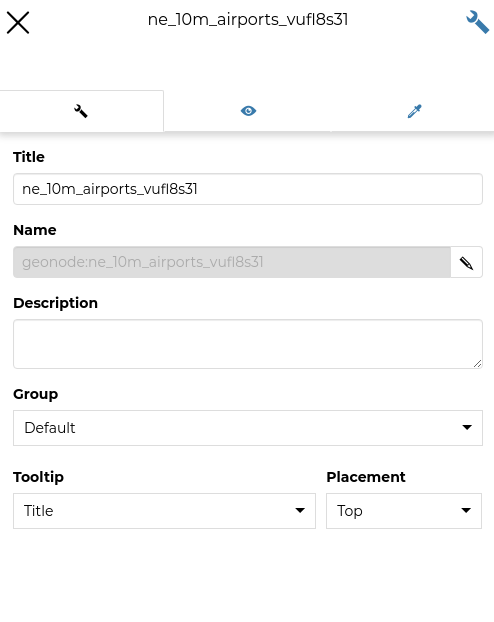

.. _toc:

Table of Contents (TOC)
=======================

In the upper left corner, click on |toc_button| to open the *Table Of Contents*, briefly *TOC* from now on, of the map.
The *TOC* shows all the datasets involved with the *Map* and allows to manage their properties and representations on the map.

     *The Table Of Contents (TOC)*

From the *TOC* you can:

* manage the datasets *Overlap*;
* filter the datasets list by typing text in the *Filter Datasets* field;
* manage the datasets properties such as *Opacity* (scroll the opacity cursor), *Visibility* (click on |hide_button| to make the dataset not visible, click on |show_button| to show it on map);
* manage the *Dataset Settings*, see the next paragraph.

     *Scrolling the Dataset Opacity*

Select a *Dataset* from the list and click on it, the *Dataset Toolbar* should appear in the *TOC*.

     *The Dataset Toolbar*

The *Toolbar* shows you many buttons:

* the **Zoom to dataset extent** button allows you to zoom to the dataset extent;
* the **Filter layer** button that acts directly on a layer with WFS available and filter its content;
* the **Attribute Table** button to explore the features of the dataset and their attributes (more information at :ref:`attributes-table`);
* the **Delete** button to delete datasets (click on :guilabel:`Delete Dataset` to confirm your choice);
* the **Widgets** button to create Widgets (see :ref:`creating-widgets`).
* the **Export data** button;
* the **Settings** button drives you through the dataset settings customization (see the next paragraph);
* the **Compare tool** button to *Swipe* or *Spy* the selected layer
* the **Edit Style** button;

Managing Dataset Settings
-----------------------

The *Dataset Settings* panel looks like the one below.

     *The Dataset Settings Panel*

The *Dataset Settings* are divided in three groups:

1. *General* settings
2. *Visibility* settings
3. *Style* settings
4. *Tiling* settings

In the **General** tab of the *Settings Panel* you can customize the dataset *Title*, insert a *Description*, change/add the *Dataset Group* and change the *Tooltip content* and the *Tooltip placement*.

The **Visibility** tab where you can Change the *Opacity* of the layer and add the *Visibility limits* to display the layer only within certain scale limits

.. figure:: img/visibility_settings.png
     :align: center
     :height: 400px

     *The Visibility tab on Settings Panel*

The **Style** tab allows you to select the style from the available layer styles and change the *Width* and the *Height* of the *Legend*.

.. figure:: img/style_settings.png
     :align: center
     :height: 400px

     *The Style tab on Settings Panel*

Click on the **Tiling** tab to change the output *Format* of the WMS requests, the *Tile Size* and enable/disable the *Trasparent*, the *Use cache options* and the *Single Tile*.

.. figure:: img/tiling_settings.png
     :align: center
     :height: 400px

     *The Tiling tab on Settings Panel*

.. |toc_button| image:: img/toc_button.png
    :width: 30px
    :height: 30px
    :align: middle

.. |hide_button| image:: img/hide_button.png
    :width: 30px
    :height: 30px
    :align: middle

.. |show_button| image:: img/show_button.png
    :width: 30px
    :height: 30px
    :align: middle