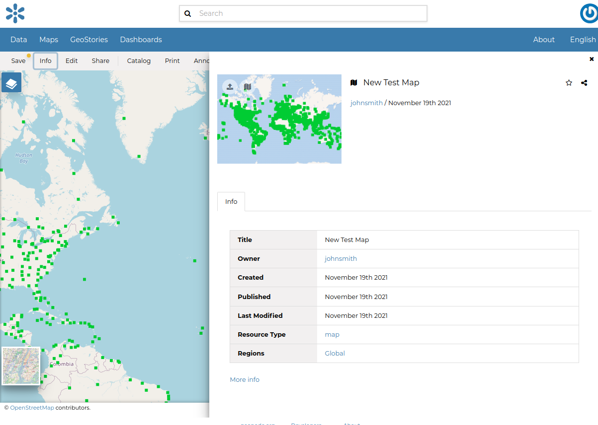

.. _map-info:

Map Information
===============

From the Maps catalogue you can select the `Open Attributes table` in order to see an overview of the interested map.

.. figure:: img/map_overview.png
    :align: center

The information panel reports:

* The *Info* tab is active by default. This tab section shows some map metadata such as its title, the abstract, date of publication etc. The metadata also indicates the map owner, what are the topic categories the map belongs to and which regions are affected.

    *Map Info tab*

* The *Location* tab shows the spacial extent of the map.

.. figure:: img/map_location.png
    :align: center

    *Map Location tab*

By clicking on the copy icons you have a copy of the current *Bounding Box* or the *Center* in the clipboard which once pasted will be a WKT text.

.. figure:: img/copy_locations_map.png
    :align: center

    *Bounding Box and Center*

* The *Relations* tab shows resources, that can be *Documents*, *Datasets*, *GeoStories* and *Dashboards*, linked to the map.

.. figure:: img/map_relations.png
    :align: center

    *Map Relations tab*

* From the *Assets* tab, the user is able to add additional assets that are related to this map.

.. figure:: img/map_assets.png
    :align: center

    *Map Assets tab*

* The *Share* tab allows to the owner of the map to edit its permissions.

.. figure:: img/map_share.png
    :align: center

    *Map Share tab*

* The *Settings* tab allows to the owner of the map to define a group, the publishing status, and more options (e.g Approved).

.. figure:: img/map_settings.png
    :align: center

    *Map Settings tab*

From the upper part of the `properties table` it is possible:

.. figure:: img/map_info_thumbnail.png
    :align: center

    *Map Info toolbar*

* `Upload` a thumbnail, `define` a new one or `remove` the thumbnail (upper left toolbar)

* `Save` a change on the map, `copy` the map's URL or `view` the detail page of the map (down right toolbar)

The detail page looks like the one shown in the picture below.

.. figure:: img/map_detail_page.png
     :align: center

     *Map page*

The *Map Viewer* shows the map with very basic functionalities:

* the *Base Map Switcher* that allows you to change the base map;
* the *Zoom in/out* tool to enlarge and decrease the view;
* the *Zoom to max extent* tool for the zoom to fit the datasets extents;
* the *Query Objects* tool to retrieve information about the map objects by clicking on the map;
* the *Print* tool to print the preview.
* the *Measure* tool to measure Distances, Areas and the Bearing of lines.
* the *Annotations* tool to add an annotation to the map 