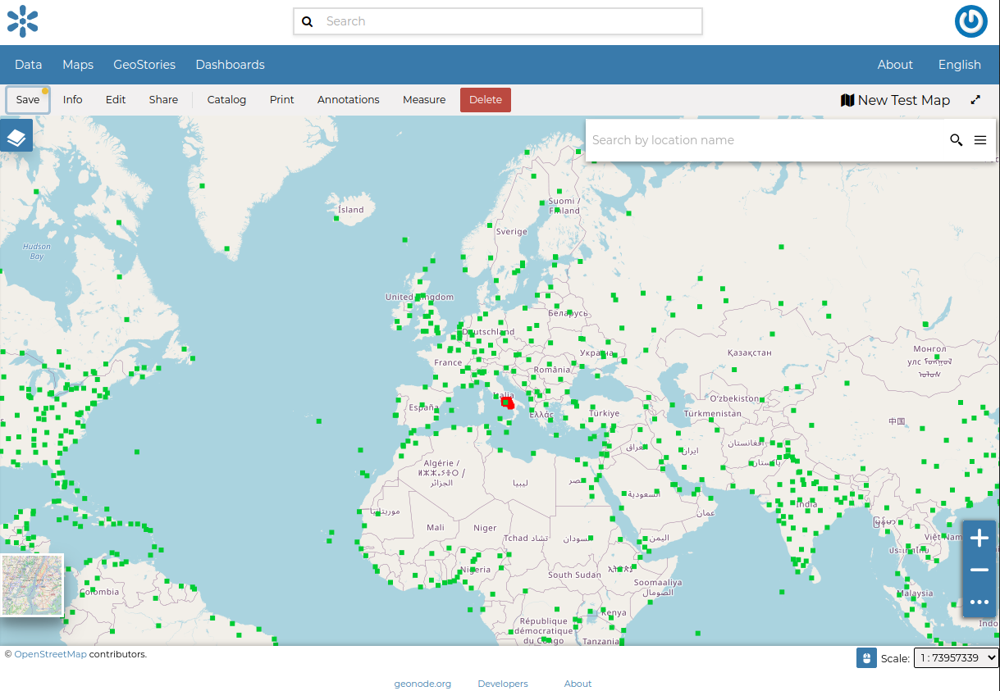

.. _map-info:

Map Information
===============

| As mentioned in the :ref:`finding-data` section, in GeoNode you can see your maps and all the published maps through the filtering feature on the resource page.
| Click on the title of the Map you are interested in to open its overview where you can see the information of the Map. This panel shows some metadata such as its Title, the License, the Publication Date etc. The metadata also indicates the map owner and which regions are involved.

On clicking :guilabel:`View Map`, it should look as follows.

     *Map Detail page*

The *Map Detail Page* shows the *Map* with very basic functionalities:

* the *Base Map Switcher* that allows you to change the base map;
* the *Zoom in/out* tool to enlarge and decrease the view;
* the *Zoom to max extent* tool for the zoom to fit the datasets extents;
* the *Query Objects* tool to retrieve information about the map objects by clicking on the map;
* the *Print* tool to print the preview.
* the *Measure* tool to measure Distances, Areas and the Bearing of lines.
* the *Annotations* tool to add an annotation to the map 

Through the :guilabel:`View` button it is possible to visualize the metadata of the map.

     *Map Metadata*
