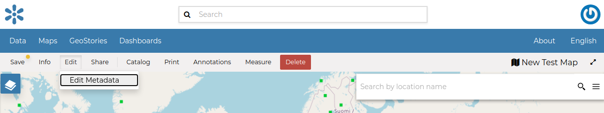
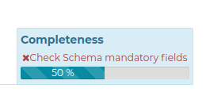
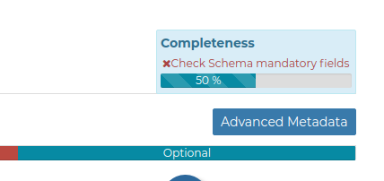

.. _map-metadata:

Maps Metadata
=============

*Maps Metadata* can be Edited by clicking the :guilabel:`Edit Metadata` link from the *Map Detail* page.

    *The Map Metadata Detail link*

The *Map Metadata* Edit form will open.
| Metadata provide essential information for the identification and the comprehension of the map. They also make the map more easily retrievable through the search tools.
| Those *Metadata* can be filled out through three-steps in which you have to provide all mandatory information to complete the process. Those three steps are described below.

* **Basic Metadata**

  .. figure:: img/basic_map_metadata.png
      :align: center

      *Basic Map Metadata*

  In the first step the system asks you to insert the following metadata (required fields are highlighted with red outlines):

  * *Thumbnail* of the map (click :guilabel:`Edit` to change it);
  * *Title* of the map, which should be clear and understandable;
  * *Abstract*; brief narrative summary of the content of the Map

        .. note:: The *Abstract* panel allows you to insert HTML code through a *wysiwyg* text editor

  * *Creation/Publication/Revision Dates*  which define the time period that is covered by the map;
  * *Keywords*, which should be chosen within the available list;
  * *Category* which the map belongs to;
  * *Group* which the map is linked to.

  Click :guilabel:`Next >>` to go to the next step.

* **Location and Licenses**

  .. figure:: img/location_licenses_map_metadata.png
      :align: center

      *Location and Licenses Metadata for Maps*

  The following list shows what kinds of metadata you are required to enter (see also the picture below):

  * *Language* of the layer;
  * *License* of the dataset;
  * *Regions* covered by the layers extent. Proposed extents cover the following scales: global, continental, regional, national;
  * *Data Quality statement* (general explanation of the data producer's knowledge about the lineage of a dataset);
  * Potential *Restrictions* on layer sharing.

  No further mandatory metadata are required in the next step so, once the required fields have been filled out, a green :guilabel:`Done` button will be visible in the screen.
  Click :guilabel:`Next >>` to go to the next step or :guilabel:`<< Back` to go back to the previous step.

* **Optional Metadata**

  .. figure:: img/optional_map_metadata.png
      :align: center

      *Optional Map Metadata*

  Complementary information are:

  * *Edition* of the map;
  * *Purpose* of the map and its objectives;
  * *Supplemental information* that can provide a better understanding of the map;
  * *Maintenance frequency* of the map;
  * *Spatial representation type*, the method used to represent geographic information in the dataset;
  * Users who are *Responsible* for the layer, its *Owner*, and the *Author* of its metadata;
  * *Related resources* to link one or multiple resources to the document. These will be visible inside the :ref:`map-info` panel

If you miss some mandatory metadata the *Completeness* bar shows you a red message like the one in the picture below.

    *Completeness Progress Bar*

Metadata Advanced Editing
-------------------------

The :guilabel:`Advanced Metadata` editing button in the Metadata Edit form allows to change the map metadata.

    *The Advanced Edit button*

Click on it to display the *Metadata Advanced Editing Page*.
That page allows you to edit all the map metadata described in the previous paragraph.

Once you have finished to edit them click on :guilabel:`Update` to save your changes.
