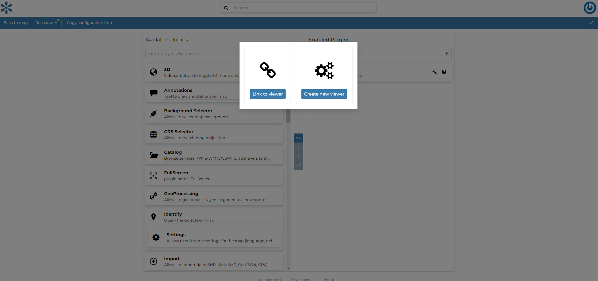
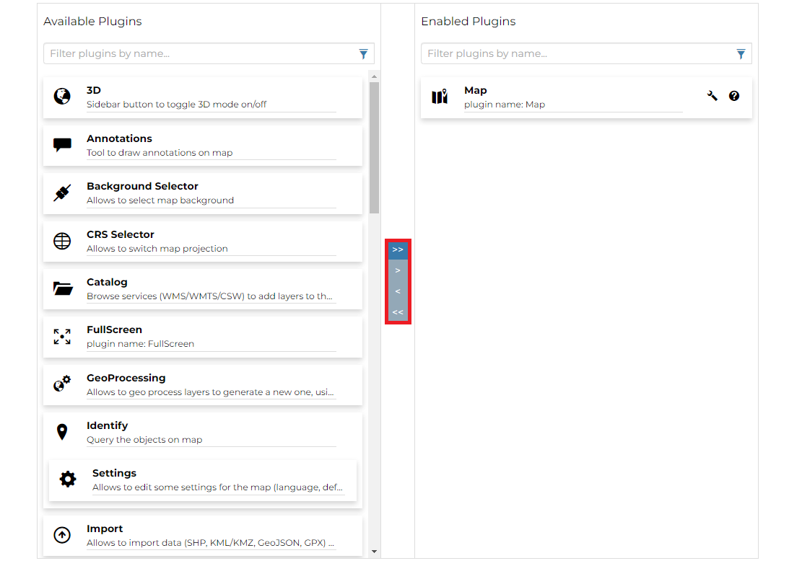

.. _map-viewers:

Map Viewer
------------------

GeoNode allows for the administrator of the map to configure a custom viewer by choosing the set of plugins available for the viewer

From the :guilabel:`Add viewer` option under the :guilabel:`Edit` options of the *Menu* a page opens and the user can:

- Select an existing viewer from the list of viewers by clicking on the :guilabel:`Link to viewer`

- Create a new viewer by clicking on the :guilabel:`Create new viewer`

     *Add viewer option*

Once the :guilabel:`Create new viewer` is selected an *Edit Plugins* page opens and, through the central vertical bar, the user can select the plugins to include in the context viewer by moving them from the **Available Plugins** list to the **Enabled Plugins** list.

     *Enable plugins fro the viewer*

To save and enable the map viewer, the user can click :guilabel:`Save as` option under the :guilabel:`Resource` options of the *Menu*.

The *Map Viewer* will be visible to all users who have permission to view the map and can be reused or modified by the user who has edit permissions on it. 
It will be available on the list of the resources on *Home Page*

See the `MapStore Documentation <https://docs.mapstore.geosolutionsgroup.com/en/latest/user-guide/application-context/#configure-plugins>`_ for more information.