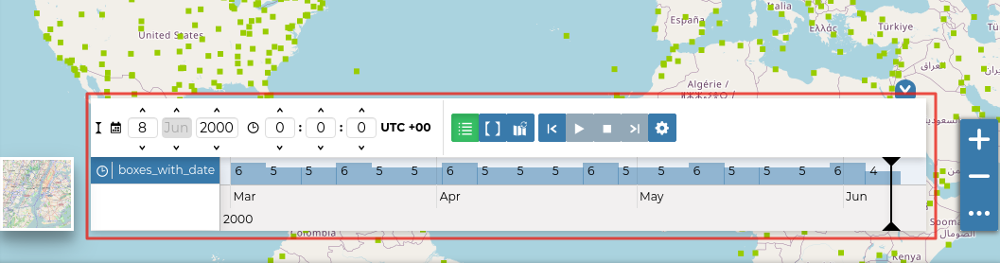
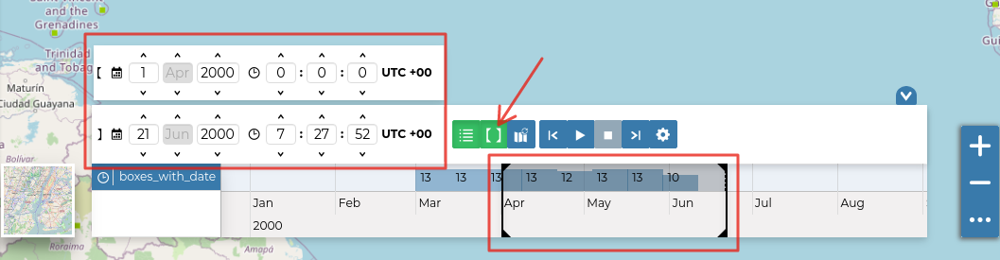
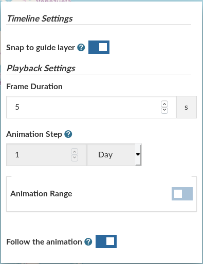
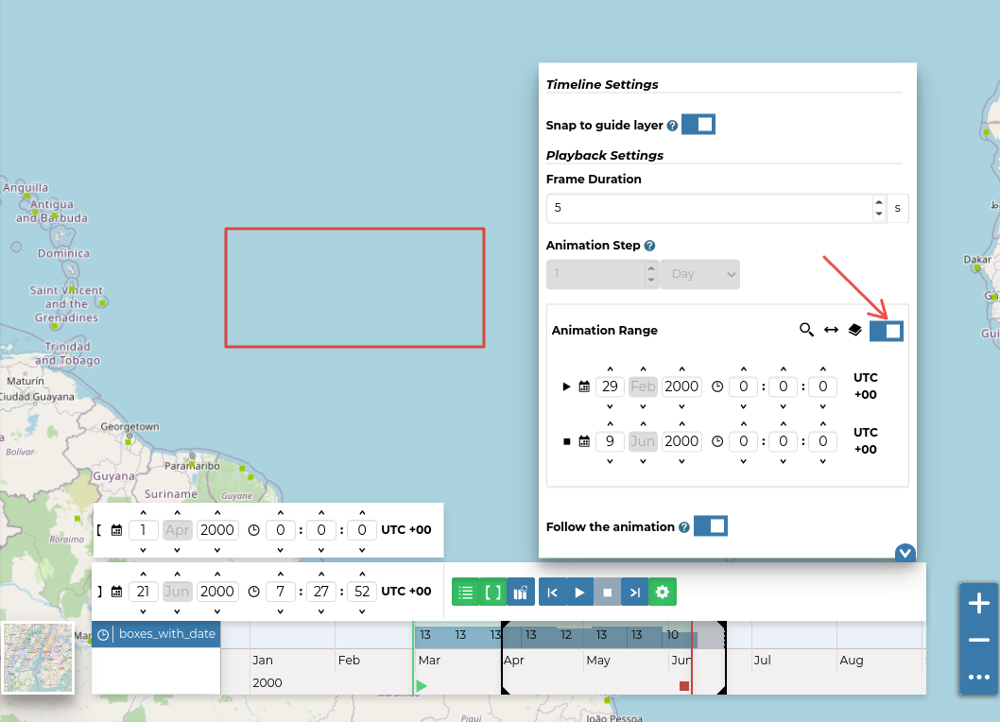

.. _timeline:

Timeline
========

| GeoNode can manage datasets with a *time dimension*. Those vector datasets may vary their data through time so it is useful to represent that variation on the map.
| The `MapStore <https://mapstore2.geo-solutions.it/mapstore/#/>`_ based map viewer used in Geonode makes available the **Timeline** tool which allows you to observe the datasets' evolution over time, to inspect the dataset configuration at a specific time instant and to view different dataset configurations time by time dynamically through animations (see the `MapStore Documentation <https://docs.mapstore.geosolutionsgroup.com/en/latest/user-guide/timeline/#animations>`_ for further details).

.. warning:: Timeline actually works only with WMTS-Multidim extension (WMS time in capabilities is not fully supported).

When loading a temporal dataset into the map, the *Timeline* opens automatically.

.. figure:: img/collapsed_timeline.png
     :align: center

     *The Timeline*

On the left side of the *Timeline* panel you can set the time value in which you want to observe the data. You can type it directly filling out the corresponding input fields or by using the up/down arrows.

.. figure:: img/time_instant_controls.png
     :align: center

     *The Time Control Buttons*

| On the other side there are the buttons responsible for managing the animations.
| In particular you can *Play* the animation by clicking |play_button|, go back to the previous time instant through |time_go_backward_button|, go forward to next time step using |time_go_forward_button| and stop the animation by clicking |stop_button|.

.. figure:: img/animation_buttons.png
     :align: center

     *The Animation Control Buttons*

The *Timeline* panel can be expanded through the |expand_timeline_button| button.

     *The Expanded Timeline*

The expanded section of the *Timeline* panel contains the *Time Datasets List* and an *Histogram* which shows you:

* the distribution of the data over time

  .. figure:: img/timeline_histogram.png
       :align: center

       *The Timeline Histogram*

* the *Time Cursor*

  .. figure:: img/time_cursor.png
       :align: center

       *The Time Cursor*

You can show/hide the datasets list by clicking |show_hide_datasets_list_button| (it is active by default).

Through the *Time Range* function you can observe the data in a finite temporal interval.
Click on |time_range_button| and set the initial and the final times to use it.

     *The Time Range Settings*

Animations
----------

| The *Timeline* allows you to see the data configurations (one for each time in which the data are defined) through ordered sequences of steps.
| As said before, you can play the resulting *Animation* by clicking the play button |play_button|.
  The dataset data displayed on map will change accordingly to the time reach by the cursor on the *Histogram*.

By clicking on |animation_settings_button| you can manage some *Animation Settings*.

     *The Timeline Settings*

| You can activate the *Snap to guide dataset* so that the time cursor will snap to the selected dataset's data. You can also set up the *Frame Duration* (by default 5 seconds).
| If the *Snap to guide dataset* option is disabled, you can force the animation step to be a fixed value.

The *Animation Range* option lets you to define a temporal range within which the time cursor can move.

     *The Timeline Animation Range*

See the `MapStore Documentation <https://docs.mapstore.geosolutionsgroup.com/en/latest/user-guide/timeline/>`_ for more information.

.. |time_go_backward_button| image:: img/time_go_backward_button.png
    :width: 30px
    :height: 30px
    :align: middle

.. |time_go_forward_button| image:: img/time_go_forward_button.png
    :width: 30px
    :height: 30px
    :align: middle

.. |expand_timeline_button| image:: img/expand_timeline_button.png
    :width: 30px
    :height: 30px
    :align: middle

.. |show_hide_datasets_list_button| image:: img/show_hide_datasets_list_button.png
    :width: 30px
    :height: 30px
    :align: middle

.. |time_range_button| image:: img/time_range_button.png
    :width: 30px
    :height: 30px
    :align: middle

.. |animation_settings_button| image:: img/animation_settings_button.png
    :width: 30px
    :height: 30px
    :align: middle

