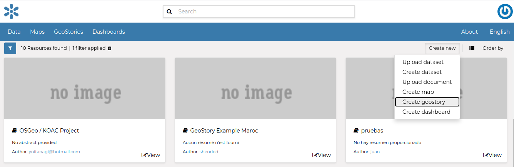

.. _geostory:

GeoStory
========

GeoStory is a MapStore tool integrated in GeoNode that provides the user a way to create inspiring and immersive stories by combining text, interactive maps, and other multimedia content like images and video or other third party contents.
Through this tool you can simply tell your stories on the web and then publish and share them with different groups of GeoNode users or make them public to everyone around the world.

To build a new GeoStory go to :guilabel:`Add Resource` option on the resource page and choose option *Create geostory*.

    *New GeoStory Apps option*

Now you landed on the GeoStory edition page that is composed of the following sections:

.. figure:: https://mapstore.readthedocs.io/en/latest/user-guide/img/exploring-stories/story-workspace.jpg
    :align: center

    *New GeoStory Apps option*

.. |add_section| image:: https://mapstore.readthedocs.io/en/latest/user-guide/img/button/add-section.jpg
    :width: 30px
    :height: 30px
    :align: middle

| The GeoStory content is organized in Sections, that can be added with the |add_section| button in the *Container* area. In particular, the user can add to the story the following kind of sections:

.. figure:: https://mapstore.readthedocs.io/en/latest/user-guide/img/exploring-stories/sections.jpg
    :align: center

    *GeoStory Sections Types*

For more information on these specific section please follow the official MapStore documentation:

* `Title Section <https://mapstore.readthedocs.io/en/latest/user-guide/title-section/>`_
* `Banner Section <https://mapstore.readthedocs.io/en/latest/user-guide/banner-section/>`_
* `Paragraph Section <https://mapstore.readthedocs.io/en/latest/user-guide/paragraph-section/>`_
* `Immersive Section <https://mapstore.readthedocs.io/en/latest/user-guide/immersive-section/>`_
* `Media Section <https://mapstore.readthedocs.io/en/latest/user-guide/media-section/>`_
* `Web Page Section <https://mapstore.readthedocs.io/en/latest/user-guide/web-section/>`_

Add GeoNode content to GeoStory
-------------------------------

With GeoNode you can add content to your GeoStory using internal GeoNode documents and maps as well external sources.
This ability to add internal GeoNode content makes the GeoStory creation a very usefull feature.

.. |edit_mode| image:: https://mapstore.readthedocs.io/en/latest/user-guide/img/button/edit-icon-1.jpg
    :width: 30px
    :height: 30px
    :align: middle

| To add GeoNode content to your GeoStory use the |edit_mode| button on top of your GeoStory section.

From here you can add :guilabel:`Images`, :guilabel:`Videos` and :guilabel:`Maps`.
To enable GeoNode internal catalog, on :guilabel:`Services` dropdown choose :guilabel:`GeoNode` as shown in picture down.
On the left you get a list of media documents available with a complementary text filter feature on top.

.. figure:: img/add_media.png
    :align: center

    *Add Media to GeoStory*

To save your GeoStory, on the top your Geostory content choose :guilabel:`Save` and then :guilabel:`Save as...`

Now your GeoStory can be shared with everyone!

Further Reading
---------------

Follow the link below to get more detailed information about the usage of GeoStory.

`GeoStory Documentation <https://mapstore.readthedocs.io/en/latest/user-guide/exploring-stories>`_
