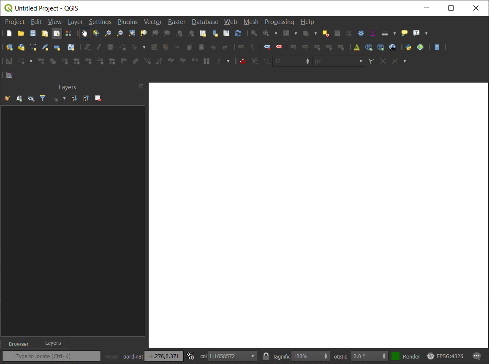
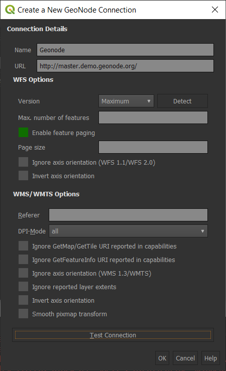
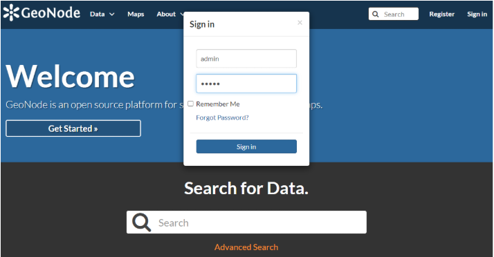
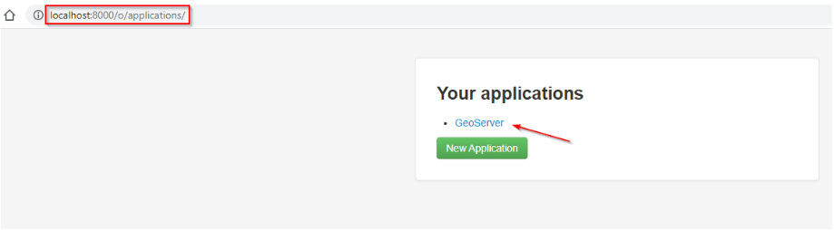
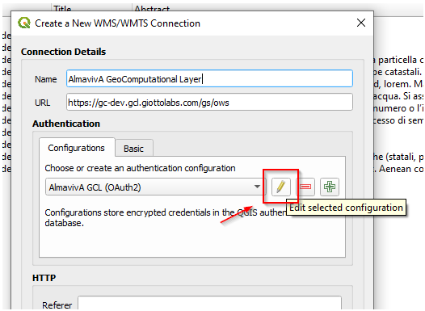

.. _qgis:

QGIS Desktop
============

QGIS is a professional GIS application that is built on top of and proud to be itself Free and Open Source Software (FOSS). QGIS is a volunteer driven project if you are interested you can find more information at https://www.qgis.org.

     *QGIS Desktop Main Window*

How can I connect to Geonode?
-----------------------------

Open QGIS Desktop and go to **Layer Menu > Data Source Manager**. At the bottom of Data Source Manager, you can see a tab 
with the name and an icon related to Geonode. This is because Geonode is recognized as a data source inside QGIS.

.. figure:: img/geonode_datamanager_dialog.PNG
     :align: center

     *Data Source Manager Dialog*

.. note::
   It's possible as well load Geonode instances from an existence file this is useful to share between users or to backup existence connections.

To add a new Geonode instance, in the Geonode tab selected click on **New** and you will see the following dialog:

     *Details of Geonode instance Dialog*

In the dialog Fill the name as you like and in the URL put the link of the Geonode instance. It's possible edit some WFS and WMS options to optimize the connection. 
If everything is ok you will receive the following successful connection dialog:

.. figure:: img/geonode_success_connection.PNG
     :align: center

     *Successful connection Dialog*

After the successful dialog it's now possible to load all layers of the Geonode instance clicking on **Connect** button. You can see both WMS and WFS connections of the Geonode and you can load to QGIS Desktop.

.. figure:: img/geonode_load_layers.PNG
     :align: center

     *Geonode instance layers Dialog*

After select a layer (WMS or WFS) click on the **Add** button and the layer will be displayed in the main window of QGIS.

.. figure:: img/geonode_example_layer.PNG
     :align: center

     *Example of Geonode layer*

.. warning::
    This procedure only work with public layers. If the layers are for private use is necessary to do 
    the standard qgis add remote WMS/WFS layers (through **Data Source Manager**) along with basic auth method and specific endpoints.

Connect to Private layers by using OAuth2
-----------------------------------------

GeoNode OAuth2 Client App Setup
^^^^^^^^^^^^^^^^^^^^^^^^^^^^^^^

Login to GeoNode as a superuser

Browse to :guilabel:`http://<geonode>/o/applications/`

Create a new specific app or, better, edit the existing one (“GeoServer”) based on `OAuth2 Authorization Code Grant Type <https://oauth.net/2/grant-types/authorization-code/#:~:text=The%20Authorization%20Code%20grant%20type,to%20request%20an%20access%20token.>`_

Click on “Edit” and add the Redirect URI :guilabel:`http://127.0.0.1:7070/qgis-client` as shown below

.. note::
     This is an example. The port and path of the URI can be customized. They must be the same on both GeoNode and QGis Client as shown later.

.. figure:: img/geonode_oauth2_003.png
     :align: center

.. figure:: img/geonode_oauth2_004.png
     :align: center

Also you will need the :guilabel:`Client ID` and :guilabel:`Client Secret` keys later when configuring QGis.

Configure QGis Desktop Client OAuth2 Authentication
^^^^^^^^^^^^^^^^^^^^^^^^^^^^^^^^^^^^^^^^^^^^^^^^^^^

Open the QGis Desktop Client and add a new OWS remote Layer configuration

.. figure:: img/geonode_oauth2_005.png
     :align: center

Create a new service connection

.. figure:: img/geonode_oauth2_006.png
     :align: center

Provide the connection details

.. note::
     *It is* :guilabel:`Important` *that the URL ends with* :guilabel:`/gs/ows`

When finished click on “+” in order to add a new auth configuration

.. figure:: img/geonode_oauth2_007.png
     :align: center

Provide the needed information as shown below:

 - Name: *any descriptive string*
 - Type: *OAuth2 authentication*
 - Grant Flow: *Authorization Code*
 - Request URL: *must end with* :guilabel:`/o/authorize/`
 - Token URL and Refresh URL: *must end with* :guilabel:`/o/token/`
 - Redirect URL: *must match with the one defined on GeoNode above*
 - Client ID and Client Secret: *must match with the one defined on GeoNode above*
 - Scopes: *openid write*
 - Enable the persistent Token Session via Headers

.. figure:: img/geonode_oauth2_008.png
     :align: center

Save and click on :guilabel:`“Connect”`. QGis will redirect you on a browser page asking to GeoNode to authenticate. Approve the Claims and go back to QGis.

.. figure:: img/geonode_oauth2_009.png
     :align: center

Remove Saved Token Sessions From QGis and Login with another User
^^^^^^^^^^^^^^^^^^^^^^^^^^^^^^^^^^^^^^^^^^^^^^^^^^^^^^^^^^^^^^^^^

Edit the QGis configuration

.. figure:: img/geonode_oauth2_010.png
     :align: center

Click on the :guilabel:`“pencil”`

Clean up the saved :guilabel:`Tokens` and save

.. figure:: img/geonode_oauth2_012.png
     :align: center

Try to connect again.