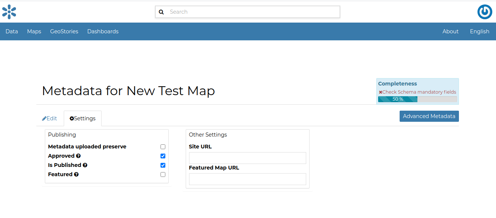

Publishing Data
===============

In GeoNode, each resource can be published in order to share it with other people.

In order to publish a map, document or dataset or any other Geonode resource, Go to the settings tab in the Metadata Edit form, The check for publishing and unpublishing is available.
See picture below.

     *Resource publishing*

Click :guilabel: `Update` to save the changes.
